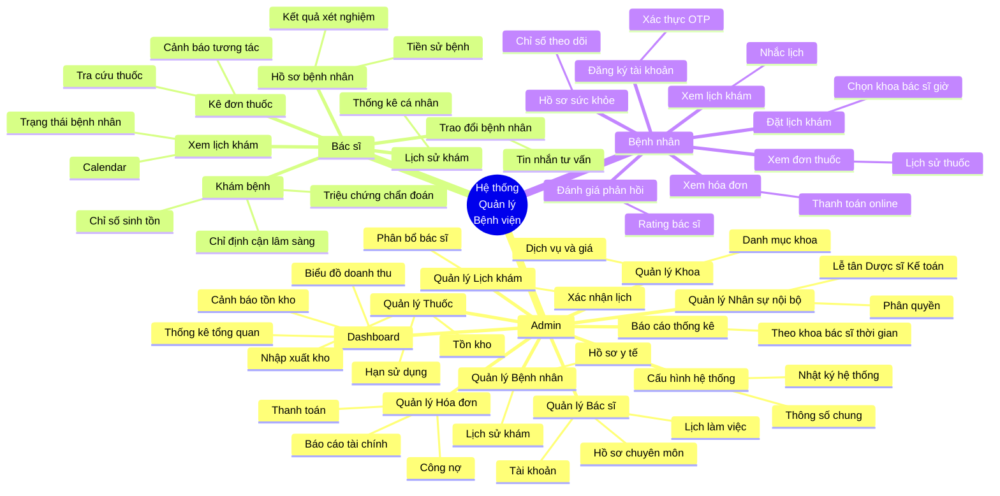
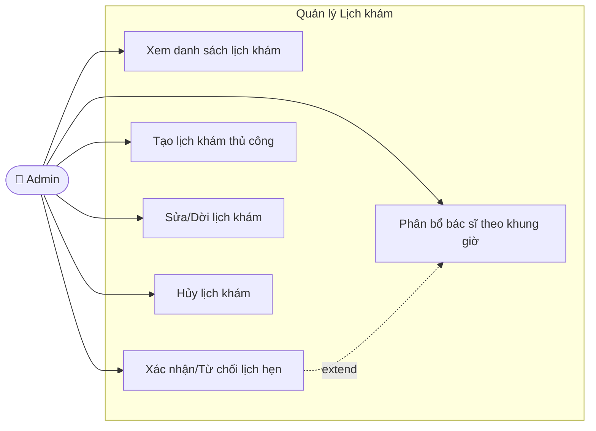
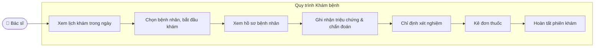
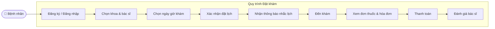
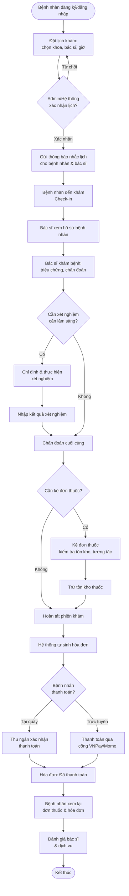
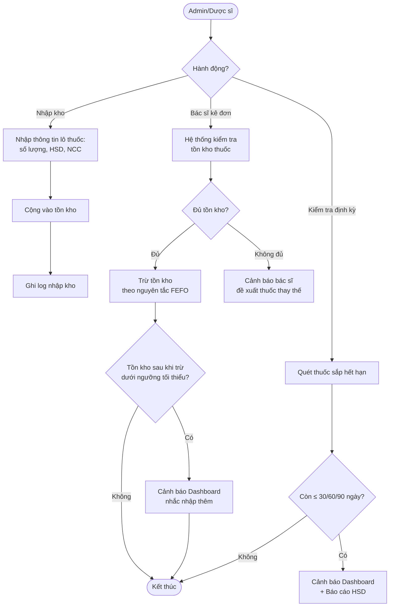
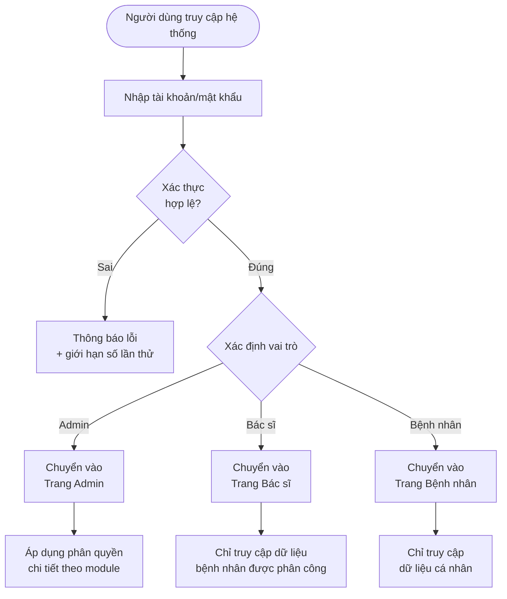
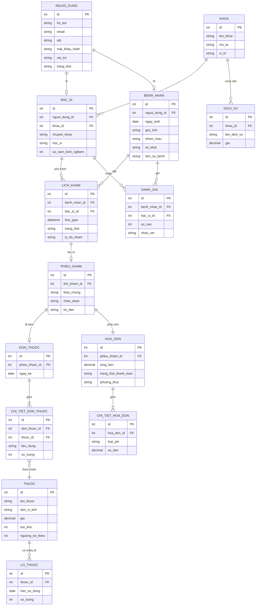

# MÔ TẢ DỰ ÁN: HỆ THỐNG QUẢN LÝ BỆNH VIỆN

## 1. Giới thiệu chung

**Tên dự án:** Hệ thống Quản lý Bệnh viện (Hospital Management System - HMS)

**Mục tiêu:** Xây dựng hệ thống phần mềm hỗ trợ quản lý toàn diện hoạt động của bệnh viện — từ khâu tiếp đón, đặt lịch, khám chữa bệnh, kê đơn, đến thanh toán và báo cáo thống kê. Hệ thống phục vụ 3 nhóm người dùng chính: **Quản trị viên (Admin)**, **Bác sĩ**, và **Bệnh nhân**, giúp số hóa quy trình, giảm thời gian chờ đợi, hạn chế sai sót và minh bạch hóa thông tin khám chữa bệnh.

**Đối tượng sử dụng:**
- Quản trị viên / Nhân viên hành chính, lễ tân bệnh viện
- Bác sĩ, nhân viên y tế (có thể mở rộng cho điều dưỡng, kỹ thuật viên xét nghiệm)
- Bệnh nhân (người đăng ký khám bệnh) và người thân/người giám hộ

**Phạm vi hệ thống:**
- Web application là nền tảng chính (Admin + Bác sĩ dùng trên desktop, Bệnh nhân dùng trên cả desktop và mobile responsive)
- Có thể mở rộng thêm ứng dụng di động (mobile app) riêng cho bệnh nhân
- Phân quyền theo 3 vai trò: Admin, Bác sĩ, Bệnh nhân (có thể mở rộng thêm vai trò Lễ tân, Dược sĩ, Kế toán trong tương lai)

**Giá trị mang lại:**
- Với bệnh viện: quản lý tập trung, báo cáo thời gian thực, giảm giấy tờ thủ công, kiểm soát tồn kho thuốc và doanh thu chặt chẽ
- Với bác sĩ: thao tác khám bệnh, kê đơn nhanh gọn, tra cứu hồ sơ bệnh nhân tức thời
- Với bệnh nhân: chủ động đặt lịch, theo dõi sức khỏe, tránh xếp hàng chờ đợi tại quầy

### Mục lục

1. [Giới thiệu chung](#1-giới-thiệu-chung)
2. [Kiến trúc tổng quan & Sơ đồ tư duy hệ thống](#2-kiến-trúc-tổng-quan--sơ-đồ-tư-duy-hệ-thống)
3. [Trang Admin — Chi tiết chức năng](#3-trang-admin--chi-tiết-chức-năng)
4. [Trang Bác sĩ — Chi tiết chức năng](#4-trang-bác-sĩ--chi-tiết-chức-năng)
5. [Trang Bệnh nhân — Chi tiết chức năng](#5-trang-bệnh-nhân--chi-tiết-chức-năng)
6. [Sơ đồ Use Case](#6-sơ-đồ-use-case-use-case-diagram)
7. [Đặc tả Use Case chi tiết](#7-đặc-tả-use-case-chi-tiết-use-case-specification)
8. [Bảng tổng hợp Use Case theo vai trò](#8-bảng-tổng-hợp-use-case-theo-vai-trò)
9. [Sơ đồ luồng nghiệp vụ](#9-sơ-đồ-luồng-nghiệp-vụ-business-flow)
10. [Sơ đồ thực thể dữ liệu (ERD)](#10-sơ-đồ-thực-thể-dữ-liệu-erd-rút-gọn)
11. [Tổng hợp ý tưởng mở rộng](#11-tổng-hợp-ý-tưởng-mở-rộng-đề-xuất-bổ-sung)
12. [Tổng hợp các thực thể dữ liệu chính](#12-tổng-hợp-các-thực-thể-dữ-liệu-chính-data-entities)
13. [Đề xuất công nghệ](#13-đề-xuất-công-nghệ-tham-khảo)
14. [Hướng phát triển dài hạn](#14-hướng-phát-triển-dài-hạn)

---

## 2. Kiến trúc tổng quan & Sơ đồ tư duy hệ thống

### 2.1. Sơ đồ khối tổng quan

```
┌──────────────────────────────────────────────────────────────────┐
│                         HỆ THỐNG QLBV                              │
├────────────────────┬────────────────────┬──────────────────────────┤
│     TRANG ADMIN     │     TRANG BÁC SĨ    │      TRANG BỆNH NHÂN     │
├────────────────────┼────────────────────┼──────────────────────────┤
│ 1. Dashboard        │ 1. Xem lịch khám    │ 1. Đăng ký tài khoản     │
│ 2. QL Bác sĩ        │ 2. Khám bệnh        │ 2. Đặt lịch khám         │
│ 3. QL Bệnh nhân     │ 3. Kê đơn thuốc     │ 3. Xem lịch khám         │
│ 4. QL Khoa          │ 4. Xem hồ sơ BN     │ 4. Xem đơn thuốc         │
│ 5. QL Lịch khám     │ 5. Xem lịch sử khám │ 5. Xem hóa đơn           │
│ 6. QL Thuốc         │ 6. Trao đổi/Tin nhắn│ 6. Hồ sơ sức khỏe cá nhân│
│ 7. QL Hóa đơn       │ 7. Thống kê cá nhân │ 7. Đánh giá & phản hồi   │
│ 8. QL Nhân sự/Phân  │                     │ 8. Thông báo & nhắc nhở  │
│    quyền            │                     │ 9. Thanh toán trực tuyến │
│ 9. QL Dịch vụ/Giá   │                     │                          │
│ 10. Báo cáo - Thống │                     │                          │
│     kê tổng hợp     │                     │                          │
│ 11. Cấu hình hệ     │                     │                          │
│     thống            │                     │                          │
└────────────────────┴────────────────────┴──────────────────────────┘
```

### 2.2. Sơ đồ tư duy (Mindmap) toàn hệ thống



### 2.3. Vai trò & quyền hạn

| Vai trò | Quyền hạn chính | Phạm vi dữ liệu truy cập |
|---|---|---|
| **Admin** | Toàn quyền quản trị hệ thống, quản lý danh mục, nhân sự, tài chính, cấu hình hệ thống | Toàn bộ dữ liệu hệ thống |
| **Bác sĩ** | Khám chữa bệnh, kê đơn, cập nhật hồ sơ bệnh án, xem lịch làm việc cá nhân | Chỉ bệnh nhân/lịch khám được phân công |
| **Bệnh nhân** | Đặt lịch, theo dõi lịch sử khám, đơn thuốc, hóa đơn, hồ sơ sức khỏe cá nhân | Chỉ dữ liệu của chính bệnh nhân đó |

> **Gợi ý mở rộng vai trò trong tương lai:** Lễ tân (tiếp đón, xác nhận lịch tại quầy), Dược sĩ (quản lý phát thuốc theo đơn), Kế toán (đối soát hóa đơn, báo cáo tài chính chuyên sâu), Điều dưỡng (hỗ trợ ghi nhận chỉ số sinh tồn trước khi bác sĩ khám).

---
## 3. TRANG ADMIN — Chi tiết chức năng

### 3.1. Dashboard (Bảng điều khiển tổng quan)

**Mục đích:** Cung cấp cái nhìn tổng quan, trực quan, theo thời gian thực về toàn bộ hoạt động bệnh viện, hỗ trợ ra quyết định nhanh.

**Chức năng chi tiết:**

*Nhóm thống kê số liệu (KPI Cards):*
- Tổng số bác sĩ đang hoạt động / tổng số khoa
- Tổng số bệnh nhân đã đăng ký / bệnh nhân mới trong ngày, tuần, tháng
- Tổng số lịch khám hôm nay (đã xác nhận / chờ xác nhận / đã hoàn thành / đã hủy)
- Tổng doanh thu hôm nay, tháng này, so sánh tăng/giảm % với kỳ trước

*Nhóm biểu đồ trực quan:*
- Biểu đồ đường: doanh thu theo ngày/tuần/tháng/năm
- Biểu đồ cột: số lượt khám theo từng khoa
- Biểu đồ tròn: tỷ lệ bệnh nhân theo nhóm tuổi / giới tính / loại bệnh phổ biến
- Biểu đồ xu hướng: top 10 bệnh/chẩn đoán phổ biến nhất trong tháng

*Nhóm bảng xếp hạng & cảnh báo:*
- Top khoa có lượt khám nhiều nhất
- Top bác sĩ có lượt khám / đánh giá cao nhất
- Danh sách lịch khám sắp diễn ra trong 2 giờ tới (giúp admin theo dõi vận hành)
- Cảnh báo thuốc sắp hết hàng / sắp hết hạn sử dụng (badge đỏ)
- Cảnh báo hóa đơn quá hạn thanh toán
- Cảnh báo lịch khám bị trùng / xung đột giờ của bác sĩ

*Khác:*
- Bộ lọc thời gian linh hoạt (hôm nay, 7 ngày, 30 ngày, tùy chọn khoảng ngày)
- Xuất báo cáo tổng hợp dashboard ra PDF/Excel để họp giao ban
- Widget "Nhật ký hoạt động gần đây" (audit log rút gọn) — ai vừa thao tác gì

> **💡 Ý tưởng mở rộng:** Thêm bản đồ nhiệt (heatmap) khung giờ cao điểm theo từng khoa để tối ưu phân bổ nhân sự; tích hợp dự báo (forecast) lượng bệnh nhân tuần tới dựa trên dữ liệu lịch sử.

---

### 3.2. Quản lý Bác sĩ

**Mục đích:** Quản lý toàn diện thông tin, hồ sơ năng lực và lịch làm việc của đội ngũ bác sĩ.

**Chức năng chi tiết:**

*Hồ sơ cơ bản:*
- Thêm mới: họ tên, ngày sinh, giới tính, SĐT, email, địa chỉ, ảnh đại diện, số CCCD, mã nhân viên (tự sinh)
- Thông tin chuyên môn: chuyên khoa chính/phụ, học hàm/học vị (BS, ThS, TS, PGS...), số năm kinh nghiệm, số chứng chỉ hành nghề, ngày cấp/nơi cấp, mô tả chuyên môn, bằng cấp đính kèm (file scan)

*Phân công & lịch làm việc:*
- Gán bác sĩ vào một hoặc nhiều khoa
- Thiết lập lịch làm việc theo tuần (ca sáng/chiều/tối), ngày nghỉ phép, ngày trực
- Thiết lập số lượng bệnh nhân tối đa mỗi khung giờ khám
- Cấu hình thời gian khám trung bình/bệnh nhân (vd. 15-30 phút) để hệ thống tự tính slot trống

*Quản lý tài khoản:*
- Tạo tài khoản đăng nhập (username/password tự sinh hoặc đặt thủ công), gửi email kích hoạt
- Kích hoạt / khóa / đặt lại mật khẩu tài khoản
- Phân quyền chi tiết (nếu hệ thống hỗ trợ nhiều cấp quyền bác sĩ, vd. trưởng khoa có thêm quyền duyệt lịch)

*Thao tác quản lý:*
- Sửa thông tin, xóa/vô hiệu hóa (soft delete giữ lịch sử khám đã thực hiện)
- Tìm kiếm, lọc theo tên/khoa/chuyên môn/trạng thái hoạt động
- Xem hồ sơ chi tiết: số lượt khám đã thực hiện, đánh giá trung bình từ bệnh nhân, biểu đồ hiệu suất theo tháng
- Xuất danh sách bác sĩ (Excel/PDF)

> **💡 Ý tưởng mở rộng:** Hồ sơ "CV điện tử" công khai cho bệnh nhân xem khi chọn bác sĩ đặt lịch; chức năng xếp hạng bác sĩ tự động dựa trên đánh giá + tỷ lệ tái khám; cảnh báo xung đột lịch khi 2 lịch hẹn trùng giờ.

---

### 3.3. Quản lý Bệnh nhân

**Mục đích:** Quản lý hồ sơ và lịch sử y tế của toàn bộ bệnh nhân.

**Chức năng chi tiết:**

*Hồ sơ cá nhân:*
- Danh sách bệnh nhân: tìm kiếm theo tên/SĐT/mã bệnh nhân/CCCD/BHYT
- Thêm mới (đăng ký trực tiếp tại quầy lễ tân)
- Thông tin: họ tên, ngày sinh, giới tính, địa chỉ, SĐT, email, CCCD, nhóm máu, số thẻ BHYT, người liên hệ khẩn cấp

*Hồ sơ y tế (Electronic Medical Record - EMR rút gọn):*
- Tiền sử bệnh, bệnh nền (tiểu đường, huyết áp...), dị ứng thuốc/thực phẩm
- Lịch sử khám bệnh đầy đủ theo từng lượt (liên kết với module Khám bệnh của bác sĩ)
- Lịch sử đơn thuốc đã kê
- Lịch sử hóa đơn và tình trạng thanh toán
- Chỉ số sức khỏe theo thời gian (cân nặng, huyết áp...) dạng biểu đồ xu hướng

*Thao tác quản lý:*
- Sửa thông tin, khóa/mở khóa tài khoản, xóa hồ sơ (tuân thủ quy định lưu trữ y tế tối thiểu)
- Gộp hồ sơ trùng lặp (merge duplicate patient — trường hợp bệnh nhân đăng ký 2 lần)
- Xuất danh sách bệnh nhân (Excel/PDF)
- Ghi chú nội bộ của admin/lễ tân về bệnh nhân (vd. lưu ý đặc biệt)

> **💡 Ý tưởng mở rộng:** Phân loại bệnh nhân VIP/thường để ưu tiên xếp lịch; tích hợp tra cứu mã BHYT tự động qua cổng BHXH; gắn nhãn rủi ro sức khỏe (risk tag) để cảnh báo bác sĩ khi mở hồ sơ.

---

### 3.4. Quản lý Khoa

**Mục đích:** Quản lý danh mục các khoa/phòng chuyên môn và dịch vụ khám tương ứng.

**Chức năng chi tiết:**
- Thêm mới: tên khoa, mã khoa, mô tả, vị trí (tòa nhà/tầng/phòng), trưởng khoa, ảnh minh họa
- Sửa thông tin, xóa/vô hiệu hóa khoa
- Danh sách bác sĩ thuộc từng khoa (xem nhanh, điều chuyển bác sĩ giữa các khoa)
- Thiết lập số lượng bệnh nhân tối đa/ngày cho khoa
- Quản lý dịch vụ khám thuộc khoa: tên dịch vụ, giá khám, mô tả, thời gian thực hiện (vd. Khám tổng quát, Siêu âm, Nội soi...)
- Quản lý phòng khám vật lý gắn với khoa (số phòng, sức chứa)
- Thống kê lượt khám, doanh thu theo từng khoa
- Tìm kiếm, lọc danh sách khoa

> **💡 Ý tưởng mở rộng:** Sơ đồ chỉ dẫn (floor map) vị trí khoa trong bệnh viện hiển thị cho bệnh nhân; thiết lập khoa "Cấp cứu" với luồng ưu tiên đặc biệt không cần đặt lịch trước.

---

### 3.5. Quản lý Lịch khám

**Mục đích:** Điều phối toàn bộ lịch hẹn khám bệnh, đảm bảo không trùng lặp và tối ưu công suất khám.

**Chức năng chi tiết:**
- Xem danh sách lịch khám: lọc theo ngày/khoa/bác sĩ/trạng thái (chờ xác nhận, đã xác nhận, đang khám, hoàn thành, đã hủy, vắng mặt)
- Xác nhận / từ chối lịch hẹn bệnh nhân tự đặt online
- Tạo lịch khám thủ công (đặt hộ bệnh nhân qua điện thoại/tại quầy)
- Sửa / dời lịch khám (đổi giờ, đổi bác sĩ, đổi phòng)
- Hủy lịch khám kèm lý do (gửi thông báo tự động cho bệnh nhân)
- Phân bổ bác sĩ theo từng khung giờ, từng khoa, tránh xung đột lịch
- Thiết lập khung giờ khám (sáng/chiều, số bệnh nhân tối đa/khung giờ, thời gian nghỉ giữa ca)
- Xem lịch dạng Calendar (ngày/tuần/tháng) kéo-thả để dời lịch nhanh
- Quản lý hàng đợi (queue) số thứ tự khám trong ngày
- Thông báo nhắc lịch tự động cho bệnh nhân và bác sĩ (email/SMS/in-app, trước 24h và 1-2h)
- Xuất báo cáo lịch khám theo ngày/tuần/tháng

> **💡 Ý tưởng mở rộng:** Cơ chế "danh sách chờ" (waitlist) — khi có người hủy lịch, tự động mời bệnh nhân trong waitlist; gợi ý slot trống gần nhất nếu khung giờ mong muốn đã đầy; tính năng check-in QR code tại quầy.

---

### 3.6. Quản lý Thuốc

**Mục đích:** Quản lý danh mục thuốc và kiểm soát kho dược chặt chẽ.

**Chức năng chi tiết:**

*Danh mục:*
- Tên thuốc, mã thuốc (SKU), hoạt chất, đơn vị tính, dạng bào chế (viên, chai, ống, gói...), nhà sản xuất
- Phân loại: kháng sinh, giảm đau, vitamin, thuốc kê đơn/không kê đơn, nhóm dược lý
- Thêm mới / sửa / xóa thuốc, đính kèm hình ảnh/tờ hướng dẫn sử dụng

*Quản lý kho:*
- Quản lý giá thuốc (giá nhập, giá bán), lịch sử thay đổi giá
- Quản lý tồn kho: số lượng nhập/xuất/tồn hiện tại theo từng lô (batch)
- Quản lý hạn sử dụng theo lô, cảnh báo thuốc sắp hết hạn (vd. còn 30/60/90 ngày)
- Cảnh báo thuốc sắp hết hàng khi dưới ngưỡng tồn kho tối thiểu (cấu hình theo từng thuốc)
- Nhập kho: ghi nhận lô nhập, nhà cung cấp, ngày nhập, hóa đơn nhập
- Xuất kho: tự động trừ tồn khi đơn thuốc được kê và xác nhận phát thuốc

*Báo cáo & tra cứu:*
- Tìm kiếm, lọc thuốc theo tên/loại/nhà sản xuất/trạng thái tồn
- Lịch sử nhập/xuất kho chi tiết (ai thao tác, khi nào)
- Báo cáo tồn kho định kỳ, báo cáo thuốc tiêu thụ nhiều nhất

> **💡 Ý tưởng mở rộng:** Quét mã vạch/QR khi nhập-xuất kho; tự động đề xuất số lượng cần nhập dựa trên tốc độ tiêu thụ trung bình; tích hợp module riêng cho Dược sĩ xác nhận phát thuốc đối chiếu đơn.

---

### 3.7. Quản lý Hóa đơn

**Mục đích:** Quản lý toàn bộ quy trình thanh toán dịch vụ khám chữa bệnh và báo cáo tài chính.

**Chức năng chi tiết:**
- Danh sách hóa đơn: lọc theo trạng thái (chưa thanh toán, đã thanh toán, đã hủy, quá hạn), theo ngày, theo bệnh nhân, theo khoa
- Tạo hóa đơn tự động từ lịch khám + đơn thuốc, hoặc tạo thủ công
- Chi tiết hóa đơn: phí khám, phí xét nghiệm/cận lâm sàng, phí thuốc, phí dịch vụ khác (vd. giường bệnh nếu nội trú)
- Áp dụng BHYT / mã giảm giá / chiết khấu (nếu có chính sách)
- Xác nhận thanh toán: tiền mặt, chuyển khoản, thẻ, ví điện tử, ghi nhận người thu ngân
- In hóa đơn / xuất PDF theo mẫu hóa đơn hợp lệ
- Hủy hóa đơn kèm lý do, quy trình duyệt hủy (nếu cần)
- Thống kê doanh thu theo ngày/tháng/năm, theo khoa, theo bác sĩ, theo loại dịch vụ
- Báo cáo công nợ: danh sách hóa đơn quá hạn chưa thanh toán, gửi nhắc nhở tự động
- Xuất báo cáo tài chính tổng hợp (Excel/PDF) phục vụ kế toán

> **💡 Ý tưởng mở rộng:** Tích hợp cổng thanh toán trực tuyến (VNPay/Momo/ZaloPay) để bệnh nhân thanh toán ngay trên hệ thống; tự động đối soát giao dịch ngân hàng; xuất hóa đơn điện tử (e-invoice) tuân thủ quy định thuế.

---

### 3.8. Quản lý Nhân sự nội bộ & Phân quyền *(đề xuất bổ sung)*

**Mục đích:** Quản lý tài khoản nhân viên hành chính, lễ tân, dược sĩ, kế toán và phân quyền chi tiết theo vai trò.

**Chức năng chi tiết:**
- Tạo/sửa/xóa tài khoản nhân viên với vai trò cụ thể (Admin, Lễ tân, Dược sĩ, Kế toán...)
- Phân quyền chi tiết theo từng module (xem/thêm/sửa/xóa)
- Nhật ký hoạt động (audit log): ai đăng nhập, thao tác gì, vào lúc nào
- Quản lý phiên đăng nhập, buộc đăng xuất từ xa khi nghi ngờ bất thường

---

### 3.9. Quản lý Dịch vụ & Bảng giá *(đề xuất bổ sung)*

**Mục đích:** Thiết lập và cập nhật bảng giá dịch vụ y tế áp dụng toàn viện.

**Chức năng chi tiết:**
- Danh mục dịch vụ: khám tổng quát, xét nghiệm, chẩn đoán hình ảnh, tiểu phẫu...
- Thiết lập giá theo từng dịch vụ, theo từng khoa
- Lịch sử thay đổi giá (áp dụng từ ngày nào)
- Gói khám sức khỏe định kỳ (combo dịch vụ với giá ưu đãi)

---

### 3.10. Báo cáo & Thống kê tổng hợp *(đề xuất bổ sung)*

**Mục đích:** Cung cấp các báo cáo chuyên sâu phục vụ quản trị và ra quyết định chiến lược.

**Chức năng chi tiết:**
- Báo cáo doanh thu chi tiết theo nhiều chiều (khoa, bác sĩ, dịch vụ, thời gian)
- Báo cáo hiệu suất bác sĩ (số lượt khám, đánh giá, tỷ lệ tái khám)
- Báo cáo bệnh tật theo mùa/khu vực (hỗ trợ dự báo dịch bệnh)
- Báo cáo tồn kho và tiêu thụ thuốc
- Tùy chỉnh và lưu mẫu báo cáo (custom report builder)
- Lên lịch gửi báo cáo tự động qua email định kỳ

---

### 3.11. Cấu hình hệ thống *(đề xuất bổ sung)*

**Mục đích:** Thiết lập các thông số vận hành chung của hệ thống.

**Chức năng chi tiết:**
- Thông tin bệnh viện (tên, logo, địa chỉ, SĐT hiển thị trên hóa đơn/đơn thuốc)
- Cấu hình giờ làm việc chung, ngày nghỉ lễ
- Cấu hình mẫu thông báo (email/SMS template)
- Cấu hình quy tắc đặt lịch (số giờ tối thiểu trước khi hủy, số lượt đặt tối đa/bệnh nhân/ngày)
- Sao lưu & phục hồi dữ liệu (backup/restore)

---
## 4. TRANG BÁC SĨ — Chi tiết chức năng

### 4.1. Xem lịch khám

**Mục đích:** Giúp bác sĩ chủ động theo dõi lịch hẹn được phân công, sắp xếp thời gian khám hợp lý.

**Chức năng chi tiết:**
- Xem danh sách lịch khám theo ngày/tuần/tháng, dạng danh sách hoặc Calendar trực quan
- Xem chi tiết từng lịch hẹn: tên bệnh nhân, giờ khám, lý do khám/triệu chứng sơ bộ bệnh nhân khai báo, trạng thái
- Lọc lịch khám theo trạng thái (chờ khám, đang khám, đã hoàn thành, vắng mặt)
- Nhận thông báo real-time khi có lịch khám mới, lịch bị đổi giờ hoặc bị hủy
- Đánh dấu "đã đến khám" / "vắng mặt" cho bệnh nhân
- Xem số lượng bệnh nhân còn lại trong ca làm việc hôm nay
- Đăng ký/đề xuất nghỉ phép, đổi ca trực (gửi yêu cầu lên Admin duyệt)

---

### 4.2. Khám bệnh

**Mục đích:** Ghi nhận đầy đủ thông tin khám, triệu chứng và chẩn đoán cho bệnh nhân, hình thành hồ sơ bệnh án điện tử.

**Chức năng chi tiết:**
- Bắt đầu phiên khám trực tiếp từ lịch hẹn đã chọn (1 click vào "Bắt đầu khám")
- Nhập triệu chứng, lý do khám chi tiết, chẩn đoán sơ bộ
- Ghi nhận chỉ số sinh tồn: huyết áp, nhịp tim, nhiệt độ, nhịp thở, cân nặng, chiều cao, BMI tự tính
- Chỉ định xét nghiệm / cận lâm sàng (xét nghiệm máu, nước tiểu, X-quang, siêu âm...) nếu cần
- Nhập/đính kèm kết quả xét nghiệm (file PDF, hình ảnh X-quang/siêu âm)
- Ghi chẩn đoán cuối cùng (có thể theo mã ICD-10 chuẩn quốc tế nếu hệ thống hỗ trợ)
- Ghi lời dặn của bác sĩ cho bệnh nhân (chế độ ăn uống, nghỉ ngơi, tái khám)
- Chỉ định lịch tái khám (nếu cần) — tự động tạo gợi ý lịch hẹn tiếp theo
- Lưu phiếu khám vào hồ sơ bệnh án, có thể xem lại/in phiếu khám
- Chuyển trực tiếp sang bước kê đơn thuốc ngay sau khi khám
- Hoàn tất phiên khám → tự động cập nhật trạng thái lịch hẹn "hoàn thành" và kích hoạt tạo hóa đơn

> **💡 Ý tưởng mở rộng:** Mẫu bệnh án soạn sẵn (template) theo từng loại bệnh thường gặp để nhập nhanh; nhận diện giọng nói (voice-to-text) để ghi chú khám nhanh hơn; tích hợp AI gợi ý chẩn đoán dựa trên triệu chứng (chỉ mang tính tham khảo, không thay thế quyết định bác sĩ).

---

### 4.3. Kê đơn thuốc

**Mục đích:** Tạo đơn thuốc điện tử chuẩn hóa, hạn chế sai sót khi kê và cấp phát thuốc.

**Chức năng chi tiết:**
- Tìm kiếm thuốc nhanh từ danh mục thuốc toàn hệ thống (theo tên, hoạt chất)
- Thêm thuốc vào đơn: liều dùng, số lượng, cách dùng (sáng/trưa/tối/trước-sau ăn), số ngày sử dụng
- Hệ thống tự tính tổng số lượng thuốc cần thiết theo liều và số ngày
- Cảnh báo tương tác thuốc giữa các thuốc trong cùng đơn (nếu có dữ liệu tương tác)
- Cảnh báo dị ứng dựa trên tiền sử dị ứng đã ghi nhận trong hồ sơ bệnh nhân
- Cảnh báo nếu thuốc sắp hết hàng trong kho (để bác sĩ cân nhắc thuốc thay thế)
- Ghi chú hướng dẫn sử dụng đặc biệt (vd. không dùng chung với rượu bia)
- Xem lại toàn bộ đơn thuốc trước khi xác nhận phát hành
- Lưu và in đơn thuốc dạng PDF theo mẫu chuẩn của bệnh viện
- Gửi đơn thuốc vào hồ sơ điện tử của bệnh nhân (bệnh nhân xem ngay trên tài khoản)
- Liên kết đơn thuốc với hóa đơn để tự động tính chi phí thuốc

> **💡 Ý tưởng mở rộng:** Đơn thuốc mẫu (preset) cho các bệnh thường gặp giúp kê nhanh; gửi đơn thuốc thẳng tới quầy dược/dược sĩ để chuẩn bị thuốc trước khi bệnh nhân ra quầy; chữ ký số bác sĩ trên đơn thuốc điện tử.

---

### 4.4. Xem hồ sơ bệnh nhân

**Mục đích:** Tra cứu nhanh, đầy đủ thông tin bệnh nhân để hỗ trợ chẩn đoán chính xác.

**Chức năng chi tiết:**
- Xem thông tin cá nhân: họ tên, tuổi, giới tính, thông tin liên hệ
- Xem tiền sử bệnh, bệnh nền, dị ứng thuốc/thực phẩm (hiển thị nổi bật, cảnh báo màu)
- Xem lịch sử khám bệnh trước đây: chẩn đoán cũ, đơn thuốc đã kê, bác sĩ đã khám
- Xem kết quả xét nghiệm/cận lâm sàng trước đó (so sánh xu hướng chỉ số qua thời gian)
- Xem biểu đồ chỉ số sức khỏe theo thời gian (huyết áp, cân nặng...)
- Tìm kiếm bệnh nhân theo tên/mã bệnh nhân/SĐT
- Chỉ xem được hồ sơ bệnh nhân thuộc lịch khám được phân công, đảm bảo bảo mật thông tin y tế (tuân thủ nguyên tắc cần biết - need to know)

---

### 4.5. Xem lịch sử khám

**Mục đích:** Giúp bác sĩ theo dõi lại toàn bộ các phiên khám đã thực hiện, phục vụ tra cứu và tự đánh giá.

**Chức năng chi tiết:**
- Danh sách các lượt khám đã hoàn thành (theo ngày, theo bệnh nhân)
- Xem lại chi tiết từng phiên khám: chẩn đoán, đơn thuốc đã kê, chỉ định xét nghiệm
- Lọc theo khoảng thời gian, theo bệnh nhân, theo loại bệnh
- Thống kê số lượt khám của bản thân theo ngày/tuần/tháng
- Xem đánh giá/phản hồi từ bệnh nhân về các lượt khám
- Xuất báo cáo lịch sử khám cá nhân (phục vụ báo cáo công việc)

---

### 4.6. Trao đổi / Tư vấn với bệnh nhân *(đề xuất bổ sung)*

**Mục đích:** Tạo kênh liên lạc trực tiếp giữa bác sĩ và bệnh nhân sau buổi khám, hỗ trợ theo dõi điều trị.

**Chức năng chi tiết:**
- Tin nhắn nội bộ (chat) giữa bác sĩ và bệnh nhân đã từng khám
- Bệnh nhân gửi câu hỏi về đơn thuốc/tình trạng bệnh, bác sĩ phản hồi
- Lịch sử trao đổi lưu trong hồ sơ
- Thông báo tin nhắn mới

> **💡 Ý tưởng mở rộng:** Tư vấn từ xa qua video call (telemedicine) cho các trường hợp tái khám đơn giản, không cần đến trực tiếp.

---

### 4.7. Thống kê cá nhân *(đề xuất bổ sung)*

**Mục đích:** Giúp bác sĩ tự theo dõi hiệu suất làm việc của bản thân.

**Chức năng chi tiết:**
- Biểu đồ số lượt khám theo tuần/tháng
- Tỷ lệ bệnh nhân tái khám
- Điểm đánh giá trung bình từ bệnh nhân, nhận xét chi tiết
- So sánh hiệu suất với kỳ trước (xu hướng tăng/giảm)

---
## 5. TRANG BỆNH NHÂN — Chi tiết chức năng

### 5.1. Đăng ký tài khoản

**Mục đích:** Cho phép bệnh nhân tự tạo tài khoản, chủ động sử dụng các dịch vụ trực tuyến của bệnh viện.

**Chức năng chi tiết:**
- Đăng ký bằng email/SĐT + mật khẩu
- Nhập thông tin cá nhân: họ tên, ngày sinh, giới tính, địa chỉ, CCCD, số thẻ BHYT (nếu có)
- Xác thực tài khoản qua OTP (email/SMS) để đảm bảo thông tin liên hệ chính xác
- Đăng nhập / quên mật khẩu / đặt lại mật khẩu qua email hoặc SMS
- Cập nhật thông tin cá nhân, đổi mật khẩu sau khi đăng ký
- Đăng nhập bằng tài khoản mạng xã hội (mở rộng: Google, Facebook)
- Thêm hồ sơ người thân (con nhỏ, người cao tuổi) dưới một tài khoản để đặt lịch hộ

> **💡 Ý tưởng mở rộng:** Đăng ký nhanh bằng số CCCD định danh điện tử (VNeID) để tự động điền thông tin; xác minh danh tính qua ảnh CCCD.

---

### 5.2. Đặt lịch khám

**Mục đích:** Cho phép bệnh nhân tự đặt lịch hẹn khám bệnh trực tuyến mọi lúc mọi nơi, giảm tải cho tổng đài/quầy lễ tân.

**Chức năng chi tiết:**
- Chọn khoa khám (có mô tả khoa, dịch vụ, giá tham khảo)
- Chọn bác sĩ cụ thể (xem hồ sơ, đánh giá, lịch trống) hoặc để hệ thống tự phân công bác sĩ phù hợp
- Chọn ngày giờ khám dựa trên lịch trống thực tế của bác sĩ (slot trống cập nhật real-time)
- Nhập lý do khám / triệu chứng sơ bộ để bác sĩ chuẩn bị trước
- Đính kèm hình ảnh/tài liệu liên quan (vd. ảnh chụp vùng da bị tổn thương, kết quả khám trước đó ở nơi khác)
- Xác nhận đặt lịch → nhận thông báo/email/SMS xác nhận kèm mã lịch hẹn
- Hủy lịch khám đã đặt (trước thời gian quy định, có lý do)
- Đổi lịch khám (dời ngày/giờ) khi còn slot trống
- Đặt lịch tái khám nhanh dựa theo chỉ định của bác sĩ ở lần khám trước
- Đặt lịch cho người thân (qua hồ sơ phụ thuộc đã thêm ở mục 5.1)

> **💡 Ý tưởng mở rộng:** Gợi ý khoa khám phù hợp dựa trên triệu chứng bệnh nhân mô tả (dạng hỏi đáp thông minh); đặt lịch theo gói khám sức khỏe định kỳ; tích hợp lấy số thứ tự online cho trường hợp khám không cần hẹn trước.

---

### 5.3. Xem lịch khám

**Mục đích:** Theo dõi đầy đủ các lịch hẹn khám đã đặt, tránh quên lịch hoặc nhầm lẫn.

**Chức năng chi tiết:**
- Danh sách lịch khám sắp tới (chờ xác nhận, đã xác nhận)
- Danh sách lịch khám đã hoàn thành / đã hủy (lịch sử)
- Xem chi tiết: bác sĩ, khoa, ngày giờ, địa điểm phòng khám, số thứ tự khám (nếu áp dụng)
- Nhận thông báo nhắc lịch khám (trước 1 ngày và trước vài giờ) qua email/SMS/in-app
- Hủy/đổi lịch trực tiếp từ trang xem lịch
- Xem bản đồ chỉ đường đến bệnh viện/phòng khám
- Check-in online trước giờ hẹn (nếu hệ thống hỗ trợ) để rút ngắn thời gian chờ tại quầy

---

### 5.4. Xem đơn thuốc

**Mục đích:** Tra cứu các đơn thuốc đã được bác sĩ kê, hỗ trợ tuân thủ điều trị đúng.

**Chức năng chi tiết:**
- Danh sách đơn thuốc theo từng lần khám
- Xem chi tiết đơn thuốc: tên thuốc, liều dùng, cách dùng, số ngày uống, lưu ý đặc biệt
- Tải về / in đơn thuốc dạng PDF
- Xem lịch sử đơn thuốc theo thời gian (theo dõi quá trình điều trị dài hạn)
- Nhắc nhở giờ uống thuốc qua thông báo đẩy (push notification)
- Đánh dấu "đã uống" từng cữ thuốc để tự theo dõi tuân thủ điều trị

> **💡 Ý tưởng mở rộng:** Đặt mua thuốc trực tuyến/giao thuốc tận nhà liên kết với nhà thuốc của bệnh viện; quét đơn thuốc giấy cũ (OCR) để số hóa lịch sử dùng thuốc trước đây.

---

### 5.5. Xem hóa đơn

**Mục đích:** Theo dõi minh bạch chi phí khám chữa bệnh và lịch sử thanh toán.

**Chức năng chi tiết:**
- Danh sách hóa đơn theo từng lượt khám
- Xem chi tiết hóa đơn: phí khám, phí thuốc, phí xét nghiệm, các khoản giảm trừ BHYT, tổng tiền
- Xem trạng thái thanh toán (đã thanh toán / chưa thanh toán / quá hạn)
- Thanh toán trực tuyến qua cổng thanh toán (thẻ ngân hàng, ví điện tử, QR code)
- Tải hóa đơn/biên lai PDF
- Xem lịch sử thanh toán đầy đủ, lọc theo khoảng thời gian
- Xuất tổng hợp chi phí khám chữa bệnh theo năm (phục vụ quyết toán bảo hiểm/thuế nếu cần)

---

### 5.6. Hồ sơ sức khỏe cá nhân *(đề xuất bổ sung)*

**Mục đích:** Tạo "sổ sức khỏe điện tử" giúp bệnh nhân chủ động theo dõi tình trạng sức khỏe lâu dài.

**Chức năng chi tiết:**
- Tổng hợp toàn bộ chỉ số sinh tồn qua các lần khám (huyết áp, cân nặng, BMI...) dạng biểu đồ xu hướng
- Tổng hợp tiền sử bệnh, dị ứng, nhóm máu ở một nơi duy nhất
- Tự nhập thêm chỉ số theo dõi tại nhà (cân nặng, huyết áp tự đo) để bác sĩ tham khảo khi tái khám
- Lưu trữ kết quả xét nghiệm/hình ảnh y khoa qua các lần khám
- Tải xuống toàn bộ hồ sơ sức khỏe (PDF) khi cần chuyển viện hoặc khám nơi khác

---

### 5.7. Đánh giá & phản hồi *(đề xuất bổ sung)*

**Mục đích:** Thu thập phản hồi chất lượng dịch vụ để bệnh viện cải thiện liên tục.

**Chức năng chi tiết:**
- Đánh giá bác sĩ sau mỗi lượt khám (số sao + nhận xét)
- Đánh giá chất lượng dịch vụ chung của bệnh viện
- Gửi khiếu nại/góp ý trực tiếp đến Admin
- Xem phản hồi/giải đáp từ bệnh viện đối với góp ý đã gửi

---

### 5.8. Thông báo & nhắc nhở *(đề xuất bổ sung)*

**Mục đích:** Trung tâm thông báo tập trung giúp bệnh nhân không bỏ lỡ thông tin quan trọng.

**Chức năng chi tiết:**
- Thông báo xác nhận/nhắc lịch khám
- Thông báo đơn thuốc mới, hóa đơn mới
- Nhắc tái khám theo lịch bác sĩ chỉ định
- Thông báo khuyến mãi/gói khám sức khỏe định kỳ từ bệnh viện
- Cài đặt tùy chọn nhận thông báo (email/SMS/app push)

---
## 6. SƠ ĐỒ USE CASE (Use Case Diagram)

### 6.1. Use case tổng quan toàn hệ thống

```mermaid
graph TB
    Admin([👤 Admin])
    BacSi([👤 Bác sĩ])
    BenhNhan([👤 Bệnh nhân])

    subgraph "HỆ THỐNG QUẢN LÝ BỆNH VIỆN"
        UC1[Đăng nhập / Đăng xuất]
        UC2[Quản lý Dashboard]
        UC3[Quản lý Bác sĩ]
        UC4[Quản lý Bệnh nhân]
        UC5[Quản lý Khoa]
        UC6[Quản lý Lịch khám]
        UC7[Quản lý Thuốc]
        UC8[Quản lý Hóa đơn]
        UC9[Quản lý Nhân sự/Phân quyền]
        UC10[Báo cáo thống kê]

        UC11[Xem lịch khám cá nhân]
        UC12[Khám bệnh]
        UC13[Kê đơn thuốc]
        UC14[Xem hồ sơ bệnh nhân]
        UC15[Xem lịch sử khám]
        UC16[Trao đổi với bệnh nhân]

        UC17[Đăng ký tài khoản]
        UC18[Đặt lịch khám]
        UC19[Xem lịch khám]
        UC20[Xem đơn thuốc]
        UC21[Xem hóa đơn]
        UC22[Thanh toán trực tuyến]
        UC23[Đánh giá phản hồi]
        UC24[Quản lý hồ sơ sức khỏe]
    end

    Admin --> UC1
    Admin --> UC2
    Admin --> UC3
    Admin --> UC4
    Admin --> UC5
    Admin --> UC6
    Admin --> UC7
    Admin --> UC8
    Admin --> UC9
    Admin --> UC10

    BacSi --> UC1
    BacSi --> UC11
    BacSi --> UC12
    BacSi --> UC13
    BacSi --> UC14
    BacSi --> UC15
    BacSi --> UC16

    BenhNhan --> UC17
    BenhNhan --> UC1
    BenhNhan --> UC18
    BenhNhan --> UC19
    BenhNhan --> UC20
    BenhNhan --> UC21
    BenhNhan --> UC22
    BenhNhan --> UC23
    BenhNhan --> UC24

    UC12 -.include.-> UC14
    UC12 -.extend.-> UC13
    UC18 -.include.-> UC6
    UC22 -.include.-> UC21
```



### 6.2. Use case chi tiết - Trang Admin



### 6.3. Use case chi tiết - Trang Bác sĩ (quy trình khám)



### 6.4. Use case chi tiết - Trang Bệnh nhân (quy trình đặt khám)



---

## 7. ĐẶC TẢ USE CASE CHI TIẾT (Use Case Specification)

> Phần này mô tả chi tiết luồng xử lý (Main Flow), luồng thay thế (Alternative Flow) và điều kiện của các use case quan trọng nhất, làm cơ sở cho việc thiết kế và phát triển.

### UC-01: Đặt lịch khám (Bệnh nhân)

| Thuộc tính | Mô tả |
|---|---|
| **Mã use case** | UC-01 |
| **Tác nhân chính** | Bệnh nhân |
| **Mô tả** | Bệnh nhân đặt lịch hẹn khám bệnh trực tuyến với bác sĩ/khoa mong muốn |
| **Điều kiện trước** | Bệnh nhân đã đăng nhập vào hệ thống |
| **Điều kiện sau** | Lịch khám được tạo với trạng thái "Chờ xác nhận"; Admin/hệ thống nhận được yêu cầu |

**Luồng chính (Main Flow):**
1. Bệnh nhân chọn chức năng "Đặt lịch khám"
2. Hệ thống hiển thị danh sách khoa khám
3. Bệnh nhân chọn khoa
4. Hệ thống hiển thị danh sách bác sĩ thuộc khoa kèm lịch trống
5. Bệnh nhân chọn bác sĩ (hoặc chọn "Tự động phân công")
6. Hệ thống hiển thị các khung giờ còn trống trong 14 ngày tới
7. Bệnh nhân chọn ngày giờ phù hợp
8. Bệnh nhân nhập lý do khám/triệu chứng sơ bộ
9. Bệnh nhân xác nhận đặt lịch
10. Hệ thống tạo bản ghi lịch khám với trạng thái "Chờ xác nhận"
11. Hệ thống gửi thông báo xác nhận (email/SMS/in-app) cho bệnh nhân kèm mã lịch hẹn
12. Hệ thống gửi thông báo cho Admin/bác sĩ về lịch hẹn mới

**Luồng thay thế:**
- **3a.** Nếu bệnh nhân không biết chọn khoa nào → hệ thống gợi ý khoa dựa trên triệu chứng mô tả
- **6a.** Nếu không còn khung giờ trống trong khoảng thời gian mong muốn → hệ thống đề xuất thêm vào danh sách chờ (waitlist) hoặc gợi ý bác sĩ khác/ngày khác
- **9a.** Nếu bệnh nhân đã có lịch hẹn trùng giờ → hệ thống cảnh báo và yêu cầu chọn lại

**Ngoại lệ:**
- Mất kết nối trong quá trình đặt lịch → hệ thống lưu nháp và cho phép tiếp tục sau

---

### UC-02: Khám bệnh (Bác sĩ)

| Thuộc tính | Mô tả |
|---|---|
| **Mã use case** | UC-02 |
| **Tác nhân chính** | Bác sĩ |
| **Mô tả** | Bác sĩ thực hiện khám và ghi nhận thông tin chẩn đoán cho bệnh nhân |
| **Điều kiện trước** | Lịch khám tồn tại với trạng thái "Đã xác nhận", bệnh nhân đã đến (check-in) |
| **Điều kiện sau** | Phiếu khám được lưu vào hồ sơ bệnh án; trạng thái lịch khám chuyển "Hoàn thành" |

**Luồng chính:**
1. Bác sĩ chọn lịch hẹn từ danh sách "Xem lịch khám"
2. Hệ thống hiển thị thông tin bệnh nhân và hồ sơ bệnh án trước đây (nếu có)
3. Bác sĩ bấm "Bắt đầu khám"
4. Bác sĩ nhập triệu chứng, ghi nhận chỉ số sinh tồn
5. Bác sĩ nhập chẩn đoán sơ bộ
6. (Tùy chọn) Bác sĩ chỉ định xét nghiệm/cận lâm sàng → hệ thống tạo yêu cầu xét nghiệm
7. Bác sĩ nhập/đính kèm kết quả xét nghiệm khi có
8. Bác sĩ nhập chẩn đoán cuối cùng và lời dặn
9. Bác sĩ chuyển sang bước "Kê đơn thuốc" (xem UC-03) hoặc bỏ qua nếu không cần thuốc
10. Bác sĩ bấm "Hoàn tất khám"
11. Hệ thống lưu phiếu khám, cập nhật trạng thái lịch hẹn "Hoàn thành"
12. Hệ thống tự động khởi tạo hóa đơn nháp dựa trên dịch vụ khám + đơn thuốc (nếu có)

**Luồng thay thế:**
- **6a.** Nếu cần xét nghiệm chuyên sâu mất nhiều thời gian → bác sĩ có thể tạm lưu phiếu khám ở trạng thái "Đang chờ kết quả CLS" và hoàn tất sau
- **2a.** Nếu là bệnh nhân mới (không có hồ sơ cũ) → hệ thống yêu cầu bác sĩ/lễ tân bổ sung thông tin tiền sử cơ bản trước khi khám

---

### UC-03: Kê đơn thuốc (Bác sĩ)

| Thuộc tính | Mô tả |
|---|---|
| **Mã use case** | UC-03 |
| **Tác nhân chính** | Bác sĩ |
| **Quan hệ** | Extend của UC-02 (Khám bệnh) |
| **Điều kiện trước** | Đã có chẩn đoán trong phiên khám hiện tại |
| **Điều kiện sau** | Đơn thuốc được lưu, liên kết với phiếu khám và hồ sơ bệnh nhân |

**Luồng chính:**
1. Bác sĩ chọn "Kê đơn thuốc" từ phiên khám hiện tại
2. Hệ thống hiển thị ô tìm kiếm thuốc
3. Bác sĩ tìm và chọn thuốc cần kê
4. Hệ thống kiểm tra tồn kho và hiển thị cảnh báo nếu thuốc sắp hết hàng
5. Hệ thống kiểm tra tiền sử dị ứng của bệnh nhân, cảnh báo nếu trùng với thuốc vừa chọn
6. Bác sĩ nhập liều dùng, cách dùng, số ngày sử dụng
7. Hệ thống tự tính số lượng thuốc cần thiết
8. Bác sĩ lặp lại bước 3-7 để thêm các thuốc khác (nếu cần)
9. Hệ thống kiểm tra tương tác thuốc giữa các thuốc trong đơn, cảnh báo nếu có
10. Bác sĩ xem lại toàn bộ đơn thuốc
11. Bác sĩ xác nhận lưu đơn thuốc
12. Hệ thống lưu đơn thuốc, gửi vào hồ sơ điện tử bệnh nhân, cập nhật chi phí vào hóa đơn nháp

**Luồng thay thế:**
- **5a.** Nếu phát hiện dị ứng trùng → hệ thống chặn và bắt buộc bác sĩ xác nhận ghi đè (override) kèm lý do, hoặc chọn thuốc thay thế
- **4a.** Nếu thuốc hết hàng hoàn toàn → hệ thống đề xuất thuốc thay thế cùng hoạt chất (nếu có)

---

### UC-04: Quản lý Hóa đơn & Thanh toán (Admin / Bệnh nhân)

| Thuộc tính | Mô tả |
|---|---|
| **Mã use case** | UC-04 |
| **Tác nhân chính** | Admin (tạo/xác nhận), Bệnh nhân (xem/thanh toán) |
| **Điều kiện trước** | Đã hoàn tất phiên khám (và/hoặc đơn thuốc) |
| **Điều kiện sau** | Hóa đơn ở trạng thái "Đã thanh toán" hoặc "Chưa thanh toán" |

**Luồng chính (tại quầy):**
1. Hệ thống tự động tạo hóa đơn nháp khi bác sĩ hoàn tất khám
2. Admin/thu ngân mở hóa đơn, kiểm tra chi tiết (phí khám, phí thuốc, phí xét nghiệm)
3. Admin áp dụng BHYT/giảm giá nếu có
4. Bệnh nhân thanh toán tại quầy (tiền mặt/thẻ/chuyển khoản)
5. Admin xác nhận thanh toán, hệ thống cập nhật trạng thái "Đã thanh toán"
6. Hệ thống in/xuất hóa đơn PDF cho bệnh nhân

**Luồng thay thế (thanh toán online):**
1. Bệnh nhân vào "Xem hóa đơn", chọn hóa đơn "Chưa thanh toán"
2. Bệnh nhân chọn "Thanh toán trực tuyến"
3. Hệ thống chuyển hướng đến cổng thanh toán (VNPay/Momo...)
4. Bệnh nhân hoàn tất thanh toán
5. Cổng thanh toán callback kết quả về hệ thống
6. Hệ thống cập nhật trạng thái hóa đơn "Đã thanh toán" và gửi biên lai điện tử

**Ngoại lệ:**
- Thanh toán online thất bại/timeout → hệ thống giữ trạng thái "Chưa thanh toán", cho phép thử lại

---

### UC-05: Quản lý tồn kho thuốc (Admin)

| Thuộc tính | Mô tả |
|---|---|
| **Mã use case** | UC-05 |
| **Tác nhân chính** | Admin |
| **Điều kiện trước** | Đã đăng nhập với quyền quản lý thuốc |
| **Điều kiện sau** | Tồn kho được cập nhật chính xác |

**Luồng chính (nhập kho):**
1. Admin chọn "Quản lý Thuốc" → "Nhập kho"
2. Admin chọn thuốc, nhập số lượng, lô, hạn sử dụng, nhà cung cấp, giá nhập
3. Hệ thống cộng số lượng vào tồn kho hiện tại
4. Hệ thống ghi log lịch sử nhập kho

**Luồng chính (xuất kho tự động theo đơn thuốc):**
1. Khi đơn thuốc được kê và xác nhận (UC-03)
2. Hệ thống tự động trừ số lượng thuốc tương ứng khỏi tồn kho (theo nguyên tắc FEFO - hết hạn trước xuất trước)
3. Nếu tồn kho sau khi trừ xuống dưới ngưỡng tối thiểu → hệ thống tạo cảnh báo trên Dashboard

**Luồng thay thế:**
- Nếu số lượng tồn không đủ đáp ứng đơn thuốc → hệ thống cảnh báo cho bác sĩ ngay tại bước kê đơn (xem UC-03 bước 4)

---

### UC-06: Đăng ký tài khoản (Bệnh nhân)

| Thuộc tính | Mô tả |
|---|---|
| **Mã use case** | UC-06 |
| **Tác nhân chính** | Bệnh nhân (khách chưa có tài khoản) |
| **Điều kiện trước** | Chưa có tài khoản trong hệ thống |
| **Điều kiện sau** | Tài khoản được tạo và xác thực thành công |

**Luồng chính:**
1. Khách truy cập trang đăng ký
2. Nhập email/SĐT, mật khẩu, thông tin cá nhân cơ bản
3. Hệ thống kiểm tra trùng lặp (email/SĐT đã tồn tại)
4. Hệ thống gửi mã OTP qua email/SMS
5. Khách nhập mã OTP để xác thực
6. Hệ thống xác nhận, tạo tài khoản, chuyển trạng thái "Đã kích hoạt"
7. Khách được chuyển đến trang hoàn thiện hồ sơ cá nhân (tùy chọn bổ sung BHYT, tiền sử bệnh...)

**Luồng thay thế:**
- **3a.** Nếu email/SĐT đã tồn tại → hệ thống thông báo và gợi ý đăng nhập hoặc khôi phục mật khẩu
- **5a.** Nếu nhập sai OTP quá 5 lần → hệ thống khóa tạm thời, yêu cầu gửi lại mã sau X phút

---

## 8. BẢNG TỔNG HỢP USE CASE THEO VAI TRÒ

| Mã | Use Case | Tác nhân | Mức ưu tiên |
|---|---|---|---|
| UC-01 | Đặt lịch khám | Bệnh nhân | Cao |
| UC-02 | Khám bệnh | Bác sĩ | Cao |
| UC-03 | Kê đơn thuốc | Bác sĩ | Cao |
| UC-04 | Quản lý hóa đơn & thanh toán | Admin, Bệnh nhân | Cao |
| UC-05 | Quản lý tồn kho thuốc | Admin | Cao |
| UC-06 | Đăng ký tài khoản | Bệnh nhân | Cao |
| UC-07 | Đăng nhập / Phân quyền | Cả 3 vai trò | Cao |
| UC-08 | Quản lý lịch khám (xác nhận/hủy/dời) | Admin | Cao |
| UC-09 | Xem hồ sơ bệnh nhân | Bác sĩ | Cao |
| UC-10 | Xem lịch sử khám | Bác sĩ, Bệnh nhân | Trung bình |
| UC-11 | Quản lý bác sĩ | Admin | Trung bình |
| UC-12 | Quản lý bệnh nhân | Admin | Trung bình |
| UC-13 | Quản lý khoa & dịch vụ | Admin | Trung bình |
| UC-14 | Xem đơn thuốc | Bệnh nhân | Trung bình |
| UC-15 | Xem hóa đơn | Bệnh nhân | Trung bình |
| UC-16 | Dashboard thống kê | Admin | Trung bình |
| UC-17 | Đánh giá & phản hồi | Bệnh nhân | Thấp |
| UC-18 | Trao đổi/tư vấn | Bác sĩ, Bệnh nhân | Thấp |
| UC-19 | Hồ sơ sức khỏe cá nhân | Bệnh nhân | Thấp |
| UC-20 | Báo cáo thống kê chuyên sâu | Admin | Thấp |

---
## 9. SƠ ĐỒ LUỒNG NGHIỆP VỤ (Business Flow)

### 9.1. Luồng tổng quát: từ đặt lịch đến thanh toán



### 9.2. Luồng quản lý kho thuốc



### 9.3. Luồng phân quyền & đăng nhập



---

## 10. SƠ ĐỒ THỰC THỂ DỮ LIỆU (ERD rút gọn)



---

## 11. TỔNG HỢP Ý TƯỞNG MỞ RỘNG (Đề xuất bổ sung)

### 11.1. Tính năng mới cho từng vai trò

| Vai trò | Ý tưởng mở rộng | Lợi ích |
|---|---|---|
| Admin | Quản lý Nhân sự & Phân quyền chi tiết | Mở rộng cho lễ tân, dược sĩ, kế toán dùng chung hệ thống |
| Admin | Quản lý Dịch vụ & Bảng giá | Linh hoạt điều chỉnh giá, tạo gói khám combo |
| Admin | Báo cáo thống kê nâng cao + dự báo | Hỗ trợ ra quyết định chiến lược, dự báo dịch bệnh theo mùa |
| Admin | Cấu hình hệ thống (template thông báo, giờ làm việc...) | Tùy biến không cần lập trình lại |
| Admin | Bản đồ nhiệt khung giờ cao điểm | Tối ưu phân bổ nhân sự, giảm chờ đợi |
| Bác sĩ | Trao đổi/tư vấn trực tuyến với bệnh nhân | Theo dõi điều trị sau khám, giảm số lượt tái khám không cần thiết |
| Bác sĩ | Thống kê hiệu suất cá nhân | Bác sĩ tự đánh giá, cải thiện chất lượng khám |
| Bác sĩ | Mẫu bệnh án & đơn thuốc soạn sẵn (template) | Tăng tốc độ khám, giảm sai sót |
| Bác sĩ | Telemedicine (tư vấn video) cho tái khám đơn giản | Tiện lợi, tiết kiệm thời gian đi lại cho bệnh nhân nhẹ |
| Bệnh nhân | Hồ sơ sức khỏe cá nhân (sổ sức khỏe điện tử) | Theo dõi sức khỏe dài hạn, mang theo khi khám nơi khác |
| Bệnh nhân | Đánh giá & phản hồi bác sĩ/dịch vụ | Bệnh viện cải thiện chất lượng liên tục |
| Bệnh nhân | Trung tâm thông báo & nhắc nhở | Không bỏ lỡ lịch khám, lịch uống thuốc |
| Bệnh nhân | Thanh toán trực tuyến đa kênh | Tiện lợi, giảm thời gian chờ tại quầy thu ngân |
| Bệnh nhân | Đặt lịch hộ người thân (hồ sơ phụ thuộc) | Phù hợp gia đình có trẻ nhỏ/người già |
| Bệnh nhân | Gợi ý khoa khám theo triệu chứng | Hỗ trợ bệnh nhân không rành y khoa chọn đúng khoa |
| Chung | Quét mã QR check-in tại quầy | Giảm thủ tục giấy tờ, rút ngắn thời gian chờ |
| Chung | Tích hợp BHYT điện tử / VNeID | Giảm thao tác nhập liệu thủ công, tăng độ chính xác |
| Chung | Chatbot hỗ trợ (FAQ, đặt lịch nhanh) | Hỗ trợ 24/7, giảm tải tổng đài |

### 11.2. Vai trò có thể mở rộng trong tương lai

- **Lễ tân:** xác nhận lịch tại quầy, check-in bệnh nhân, hỗ trợ đặt lịch qua điện thoại
- **Dược sĩ:** xác nhận và phát thuốc theo đơn, đối chiếu tồn kho thực tế
- **Kế toán:** đối soát hóa đơn, báo cáo tài chính chuyên sâu, quyết toán BHYT
- **Điều dưỡng:** ghi nhận chỉ số sinh tồn trước khi bác sĩ khám, hỗ trợ thủ thuật

---

## 12. TỔNG HỢP CÁC THỰC THỂ DỮ LIỆU CHÍNH (Data Entities)

| Thực thể | Mô tả |
|---|---|
| NguoiDung (Admin/BacSi/BenhNhan) | Tài khoản người dùng, phân quyền |
| BacSi | Hồ sơ chuyên môn bác sĩ |
| BenhNhan | Hồ sơ bệnh nhân |
| Khoa | Danh mục khoa khám |
| DichVu | Danh mục dịch vụ & bảng giá theo khoa |
| LichKham | Lịch hẹn khám bệnh |
| PhieuKham | Phiếu khám bệnh (triệu chứng, chẩn đoán) |
| Thuoc | Danh mục thuốc |
| LoThuoc | Lô thuốc (hạn sử dụng, số lượng theo lô) |
| DonThuoc | Đơn thuốc được kê cho bệnh nhân |
| ChiTietDonThuoc | Chi tiết từng loại thuốc trong đơn |
| HoaDon | Hóa đơn thanh toán |
| ChiTietHoaDon | Chi tiết từng khoản phí trong hóa đơn |
| DanhGia | Đánh giá, phản hồi của bệnh nhân về bác sĩ/dịch vụ |
| ThongBao | Thông báo gửi đến người dùng |
| NhatKyHeThong | Audit log thao tác hệ thống |

---

## 13. ĐỀ XUẤT CÔNG NGHỆ (Tham khảo)

| Thành phần | Gợi ý công nghệ |
|---|---|
| Frontend | ReactJS / Vue.js + Tailwind CSS |
| Backend | Node.js (Express/NestJS) hoặc Java Spring Boot |
| Database | MySQL / PostgreSQL |
| Authentication | JWT, phân quyền theo Role (RBAC) |
| Thông báo | Email (SMTP) / SMS OTP / Push Notification (Firebase) |
| Thanh toán | Tích hợp VNPay / Momo / ZaloPay |
| Xuất file | PDF (jsPDF/PDFKit), Excel (ExcelJS) |
| Realtime | WebSocket/Socket.io (cho lịch khám, chat, thông báo) |
| Triển khai | Docker, CI/CD |

> Đây là phần đề xuất tham khảo, có thể điều chỉnh tùy theo yêu cầu thực tế và đội ngũ phát triển.

---

## 14. HƯỚNG PHÁT TRIỂN DÀI HẠN

- Thanh toán trực tuyến đa kênh (VNPay, Momo, ZaloPay)
- Tư vấn khám bệnh từ xa (Telemedicine - video call)
- Ứng dụng di động riêng cho bệnh nhân (iOS/Android)
- Tích hợp BHYT điện tử, định danh VNeID
- Chatbot AI hỗ trợ đặt lịch và tư vấn sơ bộ
- Hệ thống đánh giá, phản hồi chất lượng khám chữa bệnh
- Tích hợp thiết bị xét nghiệm điện tử (kết nối máy xét nghiệm tự động trả kết quả)
- Phân tích dữ liệu lớn (Big Data) dự báo dịch bệnh theo khu vực/mùa
- Mở rộng vai trò: Lễ tân, Dược sĩ, Kế toán, Điều dưỡng trên cùng nền tảng
