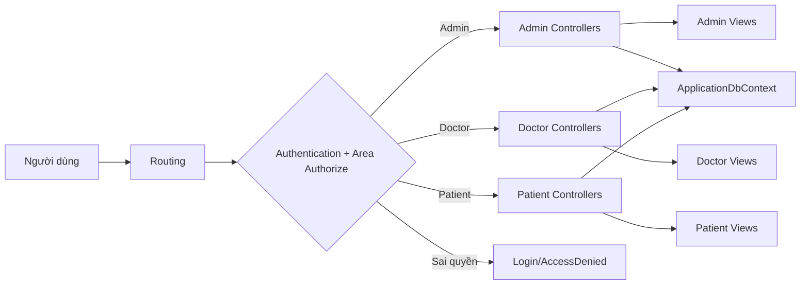
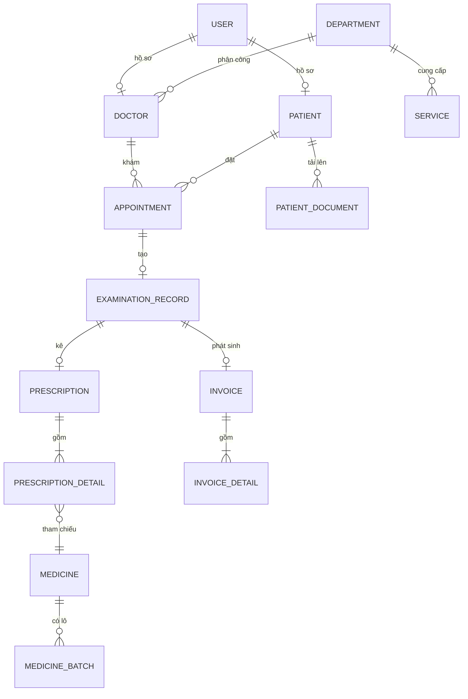
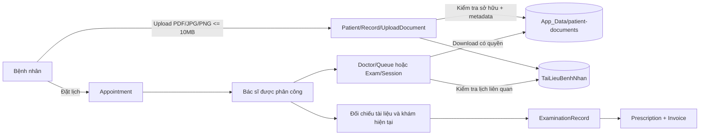
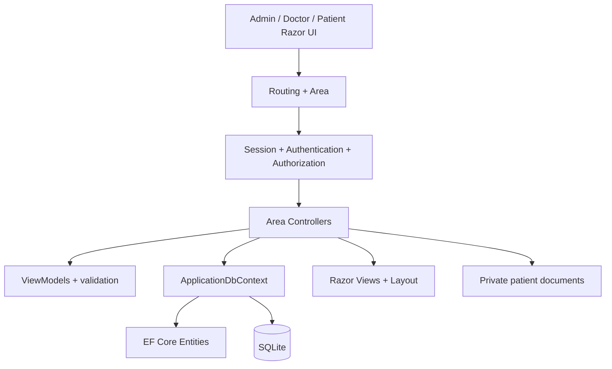
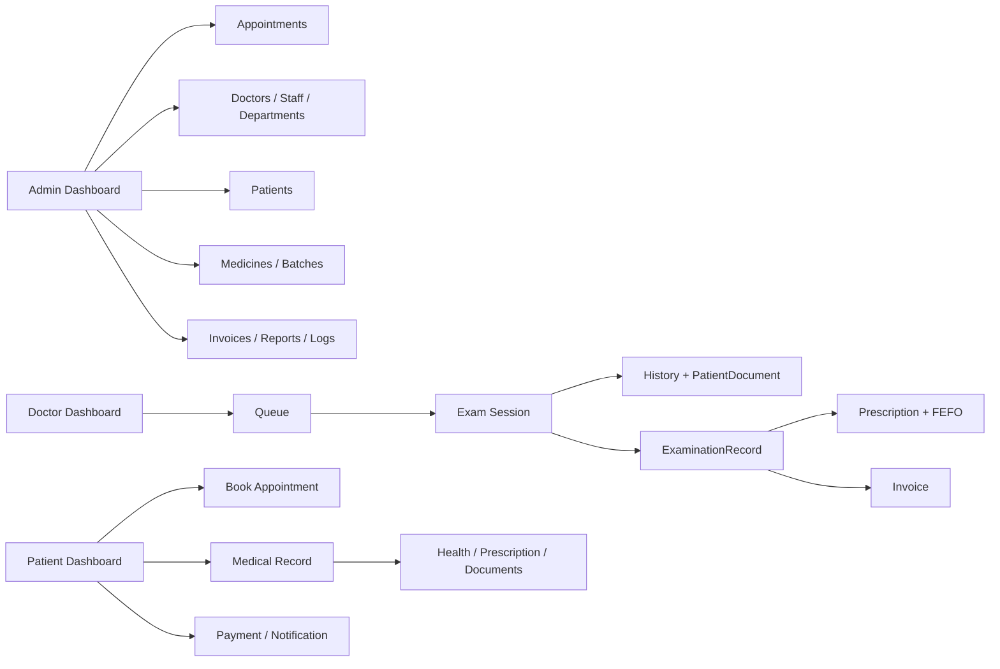
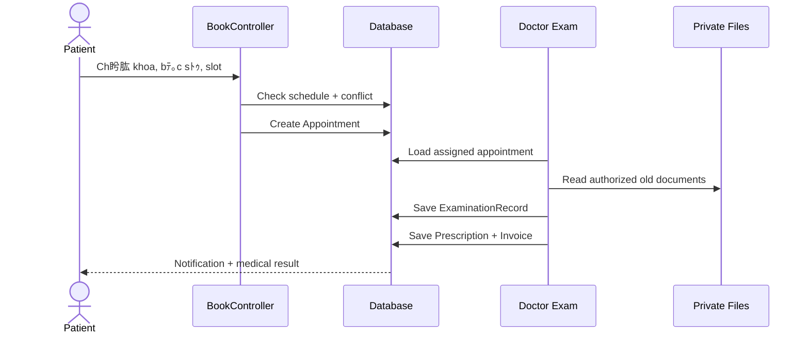
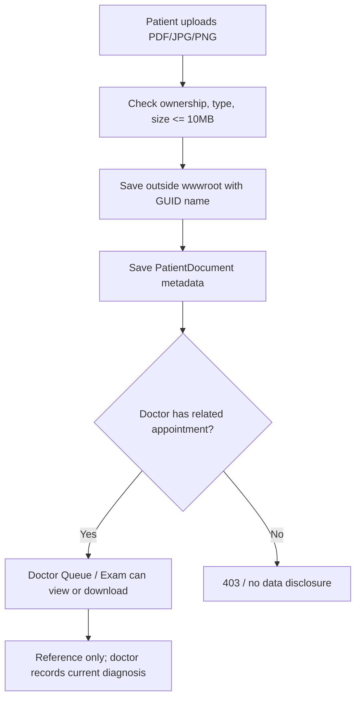

# Cấu trúc MVC và nghiệp vụ HMS

Tài liệu này phản ánh cấu trúc thực tế của repository `QuanLyBenhVien` sau khi rà soát ngày 17/07/2026. Đây là ứng dụng ASP.NET Core MVC server-rendered: Razor View là frontend, Controller là điểm nhận request/nghiệp vụ điều phối, EF Core là lớp truy cập dữ liệu.

## 1. Bố cục repository

```text
QuanLyBenhVien/
├── Areas/
│   ├── Admin/
│   │   ├── Controllers/  # Dashboard, Appointments, Doctors, Staff, Patients,
│   │   │                  # Departments, Medicines, Invoices, Reports, Logs, Settings
│   │   └── Views/<Controller>/
│   ├── Doctor/
│   │   ├── Controllers/  # Dashboard, Queue, Exam, History, Stats, Chat
│   │   └── Views/<Controller>/
│   └── Patient/
│       ├── Controllers/  # Dashboard, Book, Record, Payment, Notification
│       └── Views/<Controller>/
├── Controllers/          # HomeController, AuthController
├── Models/
│   ├── Entities/         # Entity EF Core, namespace QuanLyBenhVien.Models
│   └── ViewModels/       # Model trung gian cho form/hiển thị
├── Data/                 # ApplicationDbContext, DbSeeder
├── Migrations/           # Migration và model snapshot EF Core
├── Helpers/              # Hash mật khẩu, lịch làm việc bác sĩ
├── Views/Shared/         # Layout Admin/Doctor/Patient và partial dùng chung
├── wwwroot/              # CSS, JS, ảnh, thư viện frontend
├── Program.cs            # DI, middleware, authentication, session, route
├── appsettings*.json     # Cấu hình môi trường
├── Dockerfile            # Build container
└── render.yaml           # Deploy Render
```

## 2. Quy tắc MVC và route

- Controller trong `Areas/<Role>/Controllers` phải có `[Area("<Role>")]` và `[Authorize(Roles = "...")]`.
- View của `Areas/Admin/Controllers/DoctorsController` nằm tại `Areas/Admin/Views/Doctors`.
- Controller root dùng view tại `Views/<Controller>`, ví dụ `AuthController` dùng `Views/Auth`.
- Route Area: `/Admin/{controller}/{action}`, `/Doctor/{controller}/{action}`, `/Patient/{controller}/{action}`.
- Route root: `/{controller}/{action}`.
- Ẩn menu chỉ là trải nghiệm giao diện; mọi action vẫn phải kiểm tra quyền và phạm vi sở hữu ở server.

### Pipeline request



## 3. Đối chiếu controller và view

| Phạm vi | Controller hiện có | View hiện có |
|---|---|---|
| Root | `HomeController`, `AuthController` | `Views/Home/*`, `Views/Auth/*` |
| Admin | `Dashboard`, `Appointments`, `Doctors`, `Staff`, `Patients`, `Departments`, `Medicines`, `Invoices`, `Reports`, `Logs`, `Settings` | Có thư mục view tương ứng; có `Create/Edit/Details`, `Batches/ReceiveBatch`, `Reports/Index` theo module. |
| Doctor | `Dashboard`, `Queue`, `Exam`, `History`, `Stats`, `Chat` | `Queue/Index`, `Exam/Session`, `History/Index`, `History/RecordDetails` và các `Index`. |
| Patient | `Dashboard`, `Book`, `Record`, `Payment`, `Notification` | `Record/Index`, `Health`, `Dependents`, `PrescriptionDetails`; `Payment/Index`, `Details`, `Simulate` và các `Index`. |

Các điểm đã rà soát và khớp:

- `ReportsController` đã có `Areas/Admin/Views/Reports/Index.cshtml`.
- `Patient/Record` đã có luồng sổ khám điện tử và tài liệu khám trước.
- `Doctor/Queue` và `Doctor/Exam/Session` có thể hiển thị tài liệu của bệnh nhân đã có lịch với bác sĩ.
- Layout tách theo vai trò tại `Views/Shared/_AdminLayout.cshtml`, `_DoctorLayout.cshtml`, `_PatientLayout.cshtml`.

## 4. Entity và dữ liệu

`ApplicationDbContext` hiện có 20 DbSet:

| Nhóm | DbSet | Nghiệp vụ |
|---|---|---|
| Tài khoản | `User`, `Doctor`, `Patient` | Tài khoản, hồ sơ bác sĩ và bệnh nhân. |
| Danh mục | `Department`, `Service` | Khoa, dịch vụ và giá. |
| Lịch/khám | `Appointment`, `ExaminationRecord`, `PatientDocument` | Lịch hẹn, phiếu khám điện tử, giấy tờ khám bệnh nhân tải lên. |
| Thuốc | `Medicine`, `MedicineBatch`, `Prescription`, `PrescriptionDetail` | Danh mục thuốc, lô, đơn và chi tiết đơn. |
| Tài chính | `Invoice`, `InvoiceDetail` | Hóa đơn và các dòng phí. |
| Hỗ trợ | `Review`, `Notification`, `AuditLog`, `Dependent`, `DoctorWorkSchedule` | Đánh giá, thông báo, audit, người phụ thuộc, lịch làm việc. |

### Quan hệ chính



## 5. Nghiệp vụ theo vai trò

### Admin

- Dashboard: theo dõi lịch khám, nhân sự, bệnh nhân, doanh thu, tồn kho và audit log.
- Appointments: xác nhận, dời, hủy lịch; lưu trạng thái và lý do.
- Doctors/Staff: quản lý tài khoản, hồ sơ chuyên môn, khoa, chức vụ và lịch làm việc.
- Patients: tra cứu hồ sơ, lịch sử khám, đơn thuốc, tài liệu và hóa đơn; không xóa cứng hồ sơ đã phát sinh.
- Departments: quản lý khoa và dịch vụ; danh sách khoa/dịch vụ có cuộn độc lập trên desktop.
- Medicines: quản lý thuốc, lô, hạn dùng, nhập kho; xuất theo FEFO và không để tồn âm nếu không có override hợp lệ.
- Invoices: kiểm tra hóa đơn, dòng phí, trạng thái thanh toán và đối soát.
- Reports: báo cáo theo dữ liệu hiện có; PDF/Excel nâng cao là phạm vi mở rộng.
- Logs/Settings: audit thao tác nhạy cảm và cấu hình tham số vận hành.

### Bác sĩ

- Dashboard/Queue: chỉ xem lịch được phân công.
- Queue: xem lý do khám, dị ứng, tiền sử, chỉ số gần nhất, lịch sử và tài liệu bệnh nhân cung cấp.
- Exam: lập phiếu khám gắn với lịch, nhập triệu chứng/sinh hiệu/chẩn đoán/chỉ định/kết quả/lời dặn.
- Prescription: kiểm tra dị ứng, tương tác và tồn kho trước khi kê; trừ lô theo FEFO trong transaction.
- History/Stats: xem lịch sử bệnh nhân trong phạm vi được phân công và thống kê hoạt động cá nhân.
- Chat: tư vấn hỗ trợ, không thay thế phiếu khám chính thức.

### Bệnh nhân

- Book: chọn khoa, bác sĩ, ngày và slot; hệ thống kiểm tra lịch làm việc, ngày nghỉ và xung đột.
- Dashboard: xem lịch sắp tới, thông báo, đơn thuốc và hóa đơn của chính mình.
- Record: xem sổ khám điện tử, sức khỏe, đơn thuốc, người phụ thuộc và tải giấy tờ cũ.
- Payment: xem/thanh toán hóa đơn của chính mình; lỗi hoặc timeout giữ trạng thái chưa thanh toán.
- Notification: nhận xác nhận lịch, dời/hủy, nhắc lịch và cập nhật thanh toán.

## 6. Luồng sổ khám điện tử và giấy tờ khám trước



Quy tắc cụ thể:

1. Bệnh nhân chỉ tải, xem và xóa tài liệu của chính mình.
2. File được lưu ngoài `wwwroot` để không bị truy cập trực tiếp bằng URL tĩnh.
3. Chỉ nhận PDF/JPG/JPEG/PNG, tối đa 10MB; tên lưu trữ dùng GUID để tránh trùng tên.
4. Bác sĩ chỉ xem tài liệu khi có lịch khám liên quan với bệnh nhân đó.
5. Action download phải kiểm tra quyền trước khi trả file.
6. Tài liệu là nguồn tham khảo; bác sĩ vẫn phải đối chiếu với triệu chứng, khám hiện tại và dữ liệu chuyên môn.

## 7. Luồng khám khép kín

```text
Đăng nhập
  → Bệnh nhân đặt Appointment
  → Admin xác nhận hoặc điều phối
  → Bác sĩ mở Queue/Exam
  → Xem hồ sơ + sổ khám + giấy tờ cũ
  → Tạo ExaminationRecord
  → Kê Prescription, kiểm tra dị ứng/tồn kho
  → Xuất MedicineBatch theo FEFO
  → Tạo Invoice/InvoiceDetail
  → Thanh toán tại quầy hoặc online
  → Notification + AuditLog
```

Mọi luồng nhạy cảm phải kiểm tra quyền tại server. Các bước khám–kê đơn–trừ kho–lập hóa đơn cần transaction; callback thanh toán và thao tác có thể retry phải idempotent.

## 8. FE, BE và hạ tầng

### Frontend

- Razor Views trong `Views` và `Areas/*/Views`.
- Layout theo vai trò trong `Views/Shared`.
- CSS/JS chung trong `wwwroot/css/site.css`, `wwwroot/js/site.js`.
- Một số action trả JSON cho AJAX, ví dụ lấy bác sĩ/slot và gửi biên lai.

### Backend

- Controller nhận request, kiểm tra authorization, điều phối query/command và trả View/JSON.
- `ApplicationDbContext` quản lý DbSet, quan hệ và ràng buộc.
- `DbSeeder` tạo dữ liệu demo và đồng bộ dữ liệu cục bộ theo hướng idempotent.
- `Migrations` lưu thay đổi schema; thay entity phải tạo migration.
- `Helpers` chỉ chứa logic dùng chung như hash mật khẩu và lịch bác sĩ.

### Deploy

- `Dockerfile` build/publish ứng dụng .NET.
- `render.yaml` khai báo web service Render và health check `/`.
- SQLite production cần persistent disk nếu muốn giữ dữ liệu sau khi container được tạo lại.

## 9. Quy tắc cập nhật cấu trúc

1. Thêm entity: cập nhật model, `ApplicationDbContext`, migration, seeder và tài liệu này.
2. Thêm module: tạo controller đúng Area, view đúng thư mục, route và phân quyền server.
3. Thêm file bệnh nhân: lưu ngoài `wwwroot`, giới hạn loại/dung lượng, download qua action có quyền.
4. Không hard-code giá, slot, lịch làm việc, ngưỡng kho hoặc template thông báo trong View.
5. Không xóa cứng lịch sử khám, đơn thuốc, hóa đơn hoặc hồ sơ y tế đã phát sinh.
6. Sau thay đổi chạy build/test phù hợp và cập nhật `timelines/DD-MM-YYYY.md`.

## 10. Kết quả rà soát

Tài liệu cũ đã được vẽ lại theo cấu trúc thực tế. Các điểm lệch chính đã được sửa là: bổ sung `PatientDocument` và bảng `TaiLieuBenhNhan`, cập nhật số DbSet thành 20, ghi nhận Reports đã có View, liệt kê đầy đủ các view con của Patient Record/Payment, mô tả luồng phân quyền tài liệu và cập nhật cấu hình Docker/Render.
# ﾄ訴盻ノ b蘯｣n thi蘯ｿt k蘯ｿ chi ti盻ｿt

## Sﾆ｡ ﾄ妥・ki蘯ｿn trﾃｺc theo l盻>p



## Sﾆ｡ ﾄ妥・module theo vai trﾃｲ



## Sﾆ｡ ﾄ妥・lu盻渡g khﾃ｡m



## Sﾆ｡ ﾄ妥・tﾃi li盻㎡ b盻㌻h nhﾃ｢n



## Ma tr蘯ｭn quy盻］ d盻ｯ li盻㎡

| Resource | Admin | Doctor | Patient |
|---|---|---|---|
| Appointment | Toﾃn b盻・ | Assigned only | Own only |
| ExaminationRecord | Manage by scope | Create/update assigned | View own |
| PatientDocument | Manage by permission | Related appointment only | Own upload/view/delete |
| Prescription | Review | Create from exam | View own |
| Invoice | Manage/reconcile | Related invoice view | Own payment/retry |
| Medicine/Batch | Manage stock/FEFO | Check stock | No access |
| AuditLog | View/manage | Generated by actions | No access |

## Cﾃ｡c ﾄ訴㌻ nh蘯ｭy c蘯｣m

1. Controller ph蘯｣i ki盻ノ tra role vﾃ ownership phﾃｭa server; ẩn menu khﾃｴng ph蘯｣i lﾃ b蘯｣o m蘯ｭt.
2. Hoﾃn t蘯･t khﾃ｡m, kﾃｪ ﾄ柁｡n, tr盻ｫ kho vﾃ t蘯｡o hﾃｳa ﾄ柁｡n ph蘯｣i dﾃｹng transaction.
3. Thanh toﾃ｡n online ph蘯｣i xﾃ｡c th盻ｱc callback vﾃ idempotent; fail/timeout gi盻ｯ hﾃｳa ﾄ柁｡n chﾆｰa thanh toﾃ｡n.
4. Tﾃi li盻㎡ y t蘯ｿ lﾆｰu private, download qua action cﾃｳ authorization vﾃ khﾃｴng ﾄ黛ｻ・URL tﾄｩnh.
5. Thay ﾄ黛ｻ品 entity ph蘯｣i c蘯ｭp nh蘯ｭt DbContext, migration, seeder vﾃ tﾃi li盻㎡.
