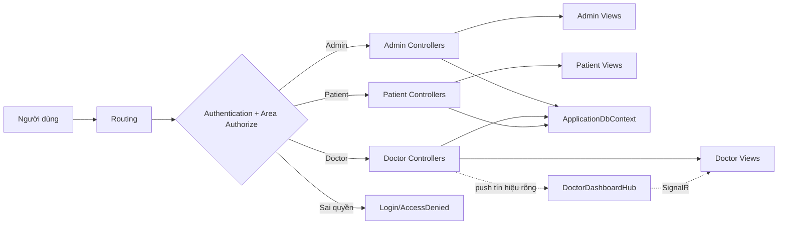
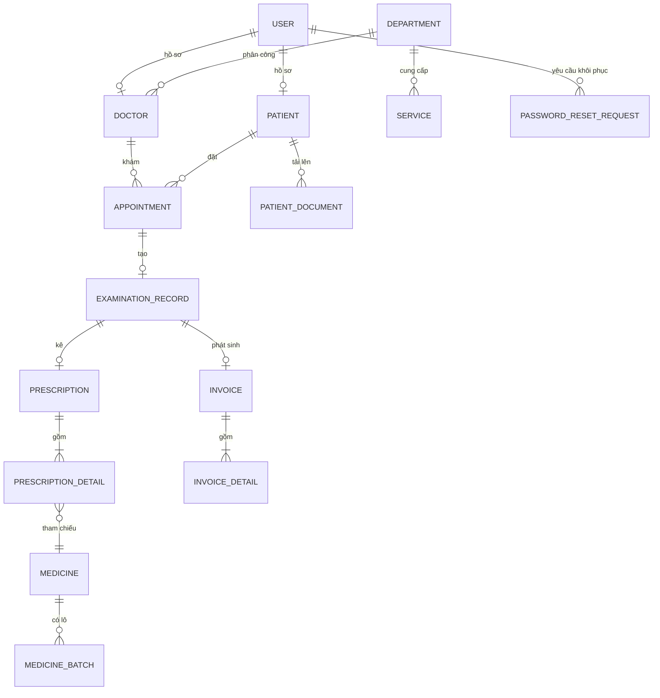
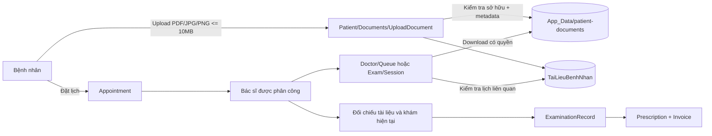

# Cấu trúc MVC và nghiệp vụ HMS

Tài liệu này phản ánh cấu trúc thực tế của repository `QuanLyBenhVien` sau khi rà soát lại ngày 31/07/2026 (lần rà soát trước: 17/07/2026 — số lượng controller/entity đã tăng đáng kể từ đó). Đây là ứng dụng ASP.NET Core MVC server-rendered: Razor View là frontend, Controller là điểm nhận request/nghiệp vụ điều phối, EF Core là lớp truy cập dữ liệu, có thêm 1 SignalR Hub cho phần realtime của bác sĩ.

## 1. Bố cục repository

```text
QuanLyBenhVien/
├── Areas/
│   ├── Admin/
│   │   ├── Controllers/  # Dashboard, Appointments, Departments, Doctors, Invoices,
│   │   │                  # Logs, Medicines, News, Patients, Reports, Settings, Staff
│   │   └── Views/<Controller>/
│   ├── Doctor/
│   │   ├── Controllers/  # Dashboard, Queue, Exam, History, Notification, Stats,
│   │   │                  # Chat, Consultation, Inpatient, LabResults,
│   │   │                  # PendingSignatures, Prescriptions, Profile, Schedule, Surgery
│   │   │                  # (9 controller cuối chỉ là khung UI, chưa có nghiệp vụ thật)
│   │   └── Views/<Controller>/
│   └── Patient/
│       ├── Controllers/  # Dashboard, Book, Appointments, Account, Documents,
│       │                  # Notification, Payment, Record, LabResults, Support
│       │                  # (LabResults chỉ là khung UI)
│       └── Views/<Controller>/
├── Controllers/          # HomeController, AuthController
├── Hubs/                 # DoctorDashboardHub — SignalR, chỉ dùng cho Doctor
├── Services/             # AppointmentSlotService, HospitalSettingsProvider,
│                          # DoctorDashboardNotifier, ExcelExportService,
│                          # IEmailSender/ISmsSender + bản mock
├── Models/
│   ├── Entities/         # Entity EF Core, namespace QuanLyBenhVien.Models
│   └── ViewModels/       # Model trung gian cho form/hiển thị
├── Data/                 # ApplicationDbContext, DbSeeder
├── Migrations/           # Migration và model snapshot EF Core
├── Helpers/              # Hash mật khẩu, lịch làm việc bác sĩ, ma trận phân quyền menu,
│                          # policy khôi phục mật khẩu, bộ lọc bắt buộc đổi mật khẩu
├── Views/Shared/         # Layout Admin/Doctor/Patient và partial dùng chung
├── wwwroot/              # CSS, JS, ảnh, thư viện frontend
├── Program.cs            # DI, middleware, authentication, session, SignalR, route
├── appsettings*.json     # Cấu hình môi trường
├── Dockerfile            # Build container
└── render.yaml           # Deploy Render
```

## 2. Quy tắc MVC và route

- Controller trong `Areas/<Role>/Controllers` phải có `[Area("<Role>")]` và `[Authorize(Roles = "...")]`.
- View của `Areas/Admin/Controllers/DoctorsController` nằm tại `Areas/Admin/Views/Doctors`.
- Controller root dùng view tại `Views/<Controller>`, ví dụ `AuthController` dùng `Views/Auth`.
- Route Area: `/Admin/{controller}/{action}`, `/Doctor/{controller}/{action}`, `/Patient/{controller}/{action}`.
- Route root: `/{controller}/{action}`.
- Ẩn menu chỉ là trải nghiệm giao diện (`ModulePermissionFilter` bật/tắt theo `RolePermission`, fail-open nếu chưa cấu hình); mọi action vẫn phải kiểm tra quyền và phạm vi sở hữu ở server.

### Pipeline request


```mermaid
flowchart LR
    U[Người dùng] --> R[Routing]
    R --> A{Authentication + Area Authorize}
    A -->|Admin| AC[Admin Controllers]
    A -->|Doctor| DC[Doctor Controllers]
    A -->|Patient| PC[Patient Controllers]
    A -->|Sai quyền| X[Login/AccessDenied]
    AC --> V1[Admin Views]
    DC --> V2[Doctor Views]
    PC --> V3[Patient Views]
    AC --> DB[ApplicationDbContext]
    DC --> DB
    PC --> DB
    DC -.push tín hiệu rỗng.-> H[DoctorDashboardHub]
    H -.SignalR.-> V2
```

## 3. Đối chiếu controller và view

| Phạm vi | Controller hiện có | View hiện có |
|---|---|---|
| Root | `HomeController`, `AuthController` | `Views/Home/*` (trang công khai), `Views/Auth/*` (đăng nhập/đăng ký/khôi phục mật khẩu 4 bước) |
| Admin | `Dashboard`, `Appointments`, `Departments`, `Doctors`, `Invoices`, `Logs`, `Medicines`, `News`, `Patients`, `Reports`, `Settings`, `Staff` | Mỗi controller có thư mục view riêng; có `Create/Edit/Details`, `Batches/ReceiveBatch/Receipts`, `PermissionMatrix` (Staff). |
| Doctor | `Dashboard`, `Queue`, `Exam`, `History`, `Notification`, `Stats`, `Chat`, `Consultation`, `Inpatient`, `LabResults`, `PendingSignatures`, `Prescriptions`, `Profile`, `Schedule`, `Surgery` | `Dashboard/Index` + 2 partial (`_QueueSection`, `_ActionRequiredSection`) dùng chung cho tải trang lẫn SignalR; `Queue/Index`, `Exam/Session`, `History/Index`, `History/RecordDetails`; 9 controller còn lại chỉ có `Index.cshtml` khung trống. |
| Patient | `Dashboard`, `Book`, `Appointments`, `Account`, `Documents`, `Notification`, `Payment`, `Record`, `LabResults`, `Support` | `Book/Index`, `Appointments/Index+Reschedule`, `Record/Index+Health+Dependents+PrescriptionDetails`, `Payment/Index+Details+Simulate`; `LabResults/Index` là khung trống. |

Các điểm đã rà soát và khớp:

- `ReportsController` đã có `Areas/Admin/Views/Reports/Index.cshtml`.
- `Patient/Record` đã có luồng sổ khám điện tử và tài liệu khám trước; `Patient/Documents` tách riêng khỏi `Record` để `ModulePermissionFilter` bật/tắt độc lập theo tên controller.
- `Doctor/Queue` và `Doctor/Exam/Session` có thể hiển thị tài liệu của bệnh nhân đã có lịch với bác sĩ.
- Layout tách theo vai trò tại `Views/Shared/_AdminLayout.cshtml`, `_DoctorLayout.cshtml`, `_PatientLayout.cshtml`; sidebar dựng từ registry cấu hình (`DoctorMenuRegistry`, `PatientMenuRegistry`) chứ không hard-code trong layout.
- Nhiều controller trong `Areas/Doctor` (Chat, Consultation, Inpatient, LabResults, PendingSignatures, Prescriptions, Profile, Schedule, Surgery) và `Areas/Patient/LabResults` **chỉ là khung UI đặt chỗ**, chưa gắn nghiệp vụ/entity thật — không nhầm là đã hoàn thiện.

## 4. Entity và dữ liệu

`ApplicationDbContext` hiện có 28 DbSet:

| Nhóm | DbSet | Nghiệp vụ |
|---|---|---|
| Tài khoản | `User`, `Doctor`, `Patient` | Tài khoản, hồ sơ bác sĩ và bệnh nhân (`User` có thêm `SecurityStamp`, `PhaiDoiMatKhau`, `MatKhauTamHetHan` phục vụ thu hồi phiên/mật khẩu tạm). |
| Danh mục | `Department`, `Service` | Khoa, dịch vụ và giá. |
| Lịch/khám | `Appointment`, `ExaminationRecord`, `PatientDocument` | Lịch hẹn, phiếu khám điện tử, giấy tờ khám bệnh nhân tải lên. |
| Thuốc | `Medicine`, `MedicineBatch`, `Prescription`, `PrescriptionDetail` | Danh mục thuốc, lô, đơn và chi tiết đơn. |
| Nhập kho | `Supplier`, `GoodsReceipt`, `GoodsReceiptDetail` | Nhà cung cấp, phiếu nhập kho có quy trình duyệt và chi tiết. |
| Tài chính | `Invoice`, `InvoiceDetail` | Hóa đơn và các dòng phí. |
| Sức khỏe & tiền sử | `FamilyHistory`, `Immunization`, `PatientHealthMetric` | Tiền sử gia đình, tiêm chủng, chỉ số sức khỏe tự đo (Sổ sức khỏe bệnh nhân). |
| Nội dung | `Article` | Tin tức đăng trên trang chủ công khai. |
| Hỗ trợ | `Review`, `Notification`, `AuditLog`, `Dependent`, `DoctorWorkSchedule` | Đánh giá, thông báo, audit, người phụ thuộc, lịch làm việc. |
| Phân quyền | `RolePermission` | Bật/tắt từng module theo vai trò (Ma trận phân quyền của Admin). |
| Khôi phục mật khẩu | `PasswordResetRequest` | Lưu hash OTP/reset-token, đếm giới hạn tần suất theo IP/tài khoản — không lưu mã/token dạng gốc. |

### Quan hệ chính


```mermaid
erDiagram
    USER ||--o| DOCTOR : "hồ sơ"
    USER ||--o| PATIENT : "hồ sơ"
    DEPARTMENT ||--o{ DOCTOR : "phân công"
    DEPARTMENT ||--o{ SERVICE : "cung cấp"
    DOCTOR ||--o{ APPOINTMENT : "khám"
    PATIENT ||--o{ APPOINTMENT : "đặt"
    APPOINTMENT ||--o| EXAMINATION_RECORD : "tạo"
    PATIENT ||--o{ PATIENT_DOCUMENT : "tải lên"
    EXAMINATION_RECORD ||--o| PRESCRIPTION : "kê"
    PRESCRIPTION ||--|{ PRESCRIPTION_DETAIL : "gồm"
    PRESCRIPTION_DETAIL }o--|| MEDICINE : "tham chiếu"
    MEDICINE ||--o{ MEDICINE_BATCH : "có lô"
    EXAMINATION_RECORD ||--o| INVOICE : "phát sinh"
    INVOICE ||--|{ INVOICE_DETAIL : "gồm"
    USER ||--o{ PASSWORD_RESET_REQUEST : "yêu cầu khôi phục"
```

### Ma trận quyền dữ liệu

| Resource | Admin | Doctor | Patient |
|---|---|---|---|
| Appointment | Toàn bộ | Chỉ lịch được phân công | Chỉ của chính mình |
| ExaminationRecord | Quản lý theo phạm vi | Tạo/cập nhật lịch được phân công | Chỉ xem của chính mình |
| PatientDocument | Quản lý theo phân quyền | Chỉ khi có lịch khám liên quan | Tự tải lên/xem/xóa |
| Prescription | Xem lại | Tạo từ phiếu khám | Chỉ xem của chính mình |
| Invoice | Quản lý/đối soát | Xem hóa đơn liên quan | Xem/thanh toán của chính mình |
| Medicine/Batch | Quản lý tồn kho/FEFO | Chỉ kiểm tra tồn kho khi kê đơn | Không truy cập |
| AuditLog | Xem/quản lý | Tự sinh theo hành động | Không truy cập |
| PasswordResetRequest | Khởi tạo cho nhân sự (gửi link/mật khẩu tạm) | Không truy cập | Tự phục vụ (ẩn danh tới khi xác thực) |

## 5. Luồng chính theo từng khu vực (Area)

### Root — `Controllers/` (dùng chung, không thuộc Area)

- **`AuthController`** — `Login`/`Register`/`VerifyOtp` (đăng ký, OTP demo cố định `123456`); luồng **Khôi phục mật khẩu 4 bước**: `ForgotPassword` (bước 1, chống dò tài khoản + captcha khi vượt ngưỡng IP) → `VerifyResetCode` (bước 2, mã 6 số, giới hạn 5 lần sai) → `ResendResetCode` (AJAX, cooldown + giới hạn số lần) → `SetNewPassword` (bước 3, từ chối trùng mật khẩu cũ) → `ResetPasswordConfirmation` (bước 4); `ForcedPasswordChange` (`[Authorize]`, bắt buộc đổi khi tài khoản dùng mật khẩu tạm do Admin cấp); `Logout`, `AccessDenied`.
- **`HomeController`** — trang công khai chưa đăng nhập: `Index`, `News`/`NewsDetail`, `Doctors` (danh sách bác sĩ công khai), `Specialities`, `Pricing`, `Guide`, `Testimonials`, `Privacy`/`About`/`Features`/`Contact`, `Error`.

### Admin — `Areas/Admin/Controllers/`

- **`DashboardController.Index`** — tổng quan lịch khám, nhân sự, bệnh nhân, doanh thu, tồn kho, audit log.
- **`AppointmentsController`** — `Index` (lọc theo ngày/trạng thái), `Export` (Excel), `Details`, `Confirm`/`Cancel` (POST, đẩy tín hiệu `QueueUpdated` cho bác sĩ liên quan).
- **`DepartmentsController`** — CRUD khoa (`CreateDepartment`/`EditDepartment`/`DeleteDepartment`) và dịch vụ theo khoa (`CreateService`/`EditService`/`DeleteService`).
- **`DoctorsController`** — `Index`/`Export`/`Details`, `Create` (tạo tài khoản bác sĩ), `Edit`, `ToggleStatus` (khóa/mở tài khoản).
- **`InvoicesController`** — `Index`/`Export`/`Details`, `PayCounter` (thanh toán tại quầy).
- **`LogsController.Index`** — xem `AuditLog`, lọc theo vai trò/hành động.
- **`MedicinesController`** — `Index`/`Batches` (kho thuốc); quy trình phiếu nhập kho: `ReceiveBatch`/`SaveDraft`/`SubmitReceipt` → `ApproveReceipt`/`RejectReceipt`/`CancelReceipt`; `Receipts`/`ReceiptDetails`/`PrintReceipt`/`PrintInspectionRecord`; `SearchMedicinesForReceipt` và `CheckExistingLot` (AJAX combobox).
- **`NewsController`** — `Index`/`Create`/`Edit`/`TogglePublish`/`Delete` bài viết tin tức trang chủ.
- **`PatientsController`** — `Index`/`Export`/`Details`, `DownloadDocument`, `UpdateAllergy`, `RevealSensitive` (AJAX, hiện đầy đủ CCCD/SĐT, có ghi audit log vì xem dữ liệu người khác), `Edit`, `AddDependent`, `UploadDocument`, `AddFamilyHistory`, `AddImmunization`, `CreateAppointment` (đặt lịch hộ), `UploadAvatar`.
- **`ReportsController`** — `Index` (báo cáo theo khoảng ngày), `Export`.
- **`SettingsController.Index`** — cấu hình chung bệnh viện (qua `HospitalSettingsProvider`, dùng lại ở `Patient/Support`).
- **`StaffController`** — `Index`/`Export`/`Details`/`Create`/`Edit`/`ToggleStatus`; **`SendResetLink`**/**`IssueTempPassword`** (2 công cụ duy nhất để giúp nhân sự lấy lại mật khẩu — Admin không bao giờ tự đặt mật khẩu cố định cho người khác); `PermissionMatrix`/`SavePermissionMatrix` (ma trận bật/tắt module theo vai trò).

### Doctor — `Areas/Doctor/Controllers/`

- **`DashboardController`** — `Index` (trang tổng quan, **có realtime** — xem mục 6); `QueueSection`/`ActionRequiredSection` (partial dùng chung cho tải trang lẫn làm mới qua SignalR); `Incomplete` (hồ sơ chưa hoàn thiện); **`CallNextPatient`** (POST, "gọi bệnh nhân tiếp theo", khóa slot atomic, trả JSON `redirectUrl`).
- **`QueueController.Index`** — hàng đợi khám theo ngày + panel chi tiết bệnh nhân được chọn; `DownloadPatientDocument`. **Không** nghe SignalR — chỉ làm mới khi điều hướng/tải lại.
- **`ExamController.Session`** — màn hình khám bệnh; `CheckAllergiesAndStock` (AJAX, cảnh báo dị ứng/tồn kho khi kê đơn); `CompleteSession` (POST, hoàn tất khám, đẩy tín hiệu `QueueUpdated` + `ActionRequiredUpdated`).
- **`HistoryController`** — `QuickSearch` (AJAX tìm bệnh nhân, dùng ở thanh tìm kiếm topbar); `BreakTheGlass` (POST, ghi log truy cập ngoài phạm vi); `Index`, `RecordDetails`.
- **`NotificationController`** — `Index`, `UnreadCount` (AJAX, badge chuông), `MarkAsRead`/`MarkAllAsRead`.
- **`StatsController.Index`** — thống kê hoạt động cá nhân bác sĩ.
- **`ChatController.Index`** — danh sách "liên hệ" từng khám — **chỉ là UI tĩnh**, chưa có backend nhắn tin/SignalR thật.
- **`ConsultationController`, `InpatientController`, `LabResultsController`, `PendingSignaturesController`, `PrescriptionsController`, `ProfileController`, `ScheduleController`, `SurgeryController`** — mỗi controller chỉ có `Index() => View()`, là khung UI/placeholder chưa gắn nghiệp vụ.

### Patient — `Areas/Patient/Controllers/`

- **`DashboardController.Index`** — tổng quan (lịch hẹn sắp tới, lượt khám gần đây, công nợ, thuốc đang dùng, nhắc tái khám theo heuristic bệnh mạn tính) — render server-side, không realtime.
- **`BookController`** — `Index` (form đặt lịch); `GetDoctors`/`GetSlots` (AJAX, JSON bác sĩ/slot theo khoa); `ConfirmBooking` (**POST form thường**, không phải JSON — dùng `TempData`+`Redirect`, cuối cùng đẩy tín hiệu `QueueUpdated`).
- **`AppointmentsController`** — `Index`, `Reschedule` (đổi lịch, mốc chặn 24h trước giờ hẹn), `Cancel` (bắt buộc lý do).
- **`AccountController`** — `Index` (hồ sơ & bảo mật), `ChangePassword`.
- **`DocumentsController`** — `Index`, `UploadDocument`, `DownloadDocument`, `DeleteDocument` (tách riêng khỏi `Record` để bật/tắt độc lập qua `ModulePermissionFilter`).
- **`NotificationController`** — `Index`, `MarkAsRead`/`MarkAllAsRead` (không có `UnreadCount`/SignalR như bên Doctor).
- **`PaymentController`** — `Index`, `Details`, `Simulate` (mô phỏng thanh toán), `PaymentCallback`, `SendEmailReceipt` (AJAX, mock gửi biên lai).
- **`RecordController`** — `Index` (sổ khám), `PrescriptionDetails`, `Health` (chỉ số sức khỏe), `AddHealthMetric`, `Dependents`/`AddDependent`, `GetReview`/`SubmitReview` (đánh giá bác sĩ, AJAX).
- **`LabResultsController.Index`** — khung UI đặt chỗ, chưa có dữ liệu kết quả xét nghiệm có cấu trúc.
- **`SupportController.Index`** — trang hỗ trợ tĩnh, đọc địa chỉ/hotline từ `HospitalSettingsProvider`.

## 6. Realtime — SignalR (chỉ riêng Doctor)

Toàn app chỉ có **1 hub**: `Hubs/DoctorDashboardHub.cs` (`[Authorize(Roles="Doctor")]`, map tại `/hubs/doctor-dashboard` trong `Program.cs`). **Patient và Admin không có SignalR.**

- Hub chỉ gửi **tín hiệu rỗng** (không kèm dữ liệu) qua `Services/DoctorDashboardNotifier.cs`: `QueueUpdated`, `ActionRequiredUpdated`, `NotificationCountChanged`. Client nhận tín hiệu rồi tự gọi lại đúng action AJAX tương ứng để lấy dữ liệu mới — không có kênh serialize dữ liệu thứ hai.
- Kết nối mở 1 lần dùng chung ở `Views/Shared/_DoctorLayout.cshtml` (`window.doctorHubConnection`), mọi trang Doctor đều thừa hưởng; badge chuông thông báo tự cập nhật ở mọi trang.
- Riêng `Areas/Doctor/Views/Dashboard/Index.cshtml` gắn thêm listener cho `QueueUpdated`/`ActionRequiredUpdated` để làm mới 2 partial hàng đợi/việc cần làm mà không cần F5.
- **Giới hạn quan trọng**: trang `Doctor/Queue` (màn hình khám theo hàng đợi đầy đủ) không nghe hub — chỉ `Dashboard/Index` mới thực sự "sống". Toàn bộ phía Patient (kể cả "Lịch hẹn sắp tới") là render tĩnh, phải tải lại trang mới thấy thay đổi do phía khác (bác sĩ/Admin) gây ra.
- Không có `setInterval`/polling nào trong toàn bộ app — mọi cập nhật "gần như realtime" đều đi qua đúng 1 hub này.

## 7. Luồng sổ khám điện tử và giấy tờ khám trước


```mermaid
flowchart LR
    P[Bệnh nhân] -->|Upload PDF/JPG/PNG <= 10MB| U[Patient/Documents/UploadDocument]
    U -->|Kiểm tra sở hữu + metadata| F[(App_Data/patient-documents)]
    U --> D[(TaiLieuBenhNhan)]
    P -->|Đặt lịch| A[Appointment]
    A --> B[Bác sĩ được phân công]
    B --> Q[Doctor/Queue hoặc Exam/Session]
    Q -->|Kiểm tra lịch liên quan| D
    Q -->|Download có quyền| F
    B --> E[Đối chiếu tài liệu và khám hiện tại]
    E --> R[ExaminationRecord]
    R --> RX[Prescription + Invoice]
```

Quy tắc cụ thể:

1. Bệnh nhân chỉ tải, xem và xóa tài liệu của chính mình.
2. File được lưu ngoài `wwwroot` để không bị truy cập trực tiếp bằng URL tĩnh.
3. Chỉ nhận PDF/JPG/JPEG/PNG, tối đa 10MB; tên lưu trữ dùng GUID để tránh trùng tên.
4. Bác sĩ chỉ xem tài liệu khi có lịch khám liên quan với bệnh nhân đó.
5. Action download phải kiểm tra quyền trước khi trả file.
6. Tài liệu là nguồn tham khảo; bác sĩ vẫn phải đối chiếu với triệu chứng, khám hiện tại và dữ liệu chuyên môn.

## 8. Luồng khám khép kín

```text
Đăng nhập
  → Bệnh nhân đặt Appointment (Patient/Book/ConfirmBooking)
  → Admin xác nhận hoặc điều phối
  → Bác sĩ mở Queue/Exam
  → Xem hồ sơ + sổ khám + giấy tờ cũ
  → Tạo ExaminationRecord
  → Kê Prescription, kiểm tra dị ứng/tồn kho
  → Xuất MedicineBatch theo FEFO
  → Tạo Invoice/InvoiceDetail
  → Thanh toán tại quầy hoặc online
  → Notification (server-side) + tín hiệu SignalR cho Dashboard bác sĩ + AuditLog
```

Mọi luồng nhạy cảm phải kiểm tra quyền tại server. Các bước khám–kê đơn–trừ kho–lập hóa đơn cần transaction; callback thanh toán và thao tác có thể retry phải idempotent.

## 9. FE, BE và hạ tầng

### Frontend

- Razor Views trong `Views` và `Areas/*/Views`.
- Layout theo vai trò trong `Views/Shared`, sidebar dựng động từ registry (`DoctorMenuRegistry`/`PatientMenuRegistry`) chứ không hard-code.
- CSS/JS chung trong `wwwroot/css/site.css`, `wwwroot/js/site.js`.
- Một số action trả JSON cho AJAX (bác sĩ/slot đặt lịch, gửi biên lai, gửi lại mã OTP khôi phục mật khẩu...) — không có project Web API riêng, đây là "API" gần nhất của hệ thống.
- 1 kết nối SignalR dùng chung cho toàn bộ trang Doctor (xem mục 6).

### Backend

- Controller nhận request, kiểm tra authorization, điều phối query/command và trả View/JSON.
- `ApplicationDbContext` quản lý DbSet, quan hệ và ràng buộc.
- `DbSeeder` tạo dữ liệu demo và đồng bộ dữ liệu cục bộ theo hướng idempotent.
- `Migrations` lưu thay đổi schema; thay entity phải tạo migration. Lưu ý: `Program.cs` dùng `EnsureCreated()` cho SQL Server/MySQL (không tự áp migration cho DB đã tồn tại — cần khối SQL "tạo nếu chưa có" riêng) và `Migrate()` cho SQLite.
- `Helpers` chứa logic dùng chung: hash mật khẩu (`HashHelper`, PBKDF2 có migrate ngầm từ SHA-256 cũ), lịch bác sĩ, ma trận phân quyền menu, policy/bộ lọc khôi phục mật khẩu.
- `Services` chứa dịch vụ dùng chung qua DI: `AppointmentSlotService` (kiểm tra/giữ slot dùng chung cho đặt mới và đổi lịch), `HospitalSettingsProvider`, `DoctorDashboardNotifier` (gọi hub), `IEmailSender`/`ISmsSender` (hiện là bản mock, ghi log thay vì gửi thật).

### Deploy

- `Dockerfile` build/publish ứng dụng .NET.
- `render.yaml` khai báo web service Render và health check `/`.
- SQLite production cần persistent disk nếu muốn giữ dữ liệu và khóa Data Protection sau khi container được tạo lại — nếu không, mỗi lần redeploy sẽ làm mất khóa mã hoá antiforgery/cookie đăng nhập của phiên cũ.

## 10. Quy tắc cập nhật cấu trúc

1. Thêm entity: cập nhật model, `ApplicationDbContext`, migration, seeder và tài liệu này.
2. Thêm module: tạo controller đúng Area, view đúng thư mục, route và phân quyền server; nếu cần bật/tắt độc lập qua Ma trận phân quyền thì phải là controller riêng (không gộp chung với controller khác).
3. Thêm file bệnh nhân: lưu ngoài `wwwroot`, giới hạn loại/dung lượng, download qua action có quyền.
4. Không hard-code giá, slot, lịch làm việc, ngưỡng kho hoặc template thông báo trong View.
5. Không xóa cứng lịch sử khám, đơn thuốc, hóa đơn hoặc hồ sơ y tế đã phát sinh.
6. Không lưu OTP/mật khẩu/token dạng gốc trong DB hay trong `AuditLog`.
7. Sau thay đổi chạy build/test phù hợp và cập nhật `timelines/DD-MM-YYYY.md`.

## 11. Kết quả rà soát

**Lần rà soát 31/07/2026**: số controller thực tế đã tăng mạnh so với lần trước (Admin 6→12, Doctor 6→15, Patient 5→10) — phần lớn controller mới bên Doctor là khung UI chưa gắn nghiệp vụ, cần nêu rõ để không hiểu nhầm là đã hoàn thiện. Bổ sung mục 5 "Luồng chính theo từng khu vực" liệt kê đầy đủ controller + action theo đúng code hiện tại; bổ sung mục 6 mô tả cơ chế realtime (SignalR chỉ có ở Doctor Dashboard, không có polling); cập nhật số DbSet 20→28 (thêm `Article`, `FamilyHistory`, `Immunization`, `PatientHealthMetric`, `RolePermission`, `Supplier`, `GoodsReceipt`, `GoodsReceiptDetail`, `PasswordResetRequest`); thêm `Hubs/` và `Services/` vào bố cục repository; dọn phần nội dung bị lỗi encoding (mojibake) trùng lặp ở cuối tài liệu cũ, giữ lại và viết sạch phần Ma trận quyền dữ liệu vì chưa có ở nơi khác.

**Lần rà soát 17/07/2026** (trước đó): bổ sung `PatientDocument` và bảng `TaiLieuBenhNhan`, cập nhật số DbSet thành 20, ghi nhận Reports đã có View, liệt kê đầy đủ các view con của Patient Record/Payment, mô tả luồng phân quyền tài liệu và cập nhật cấu hình Docker/Render.
